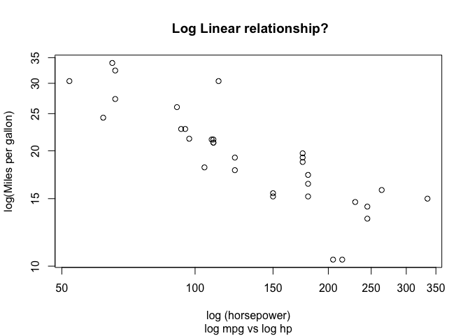
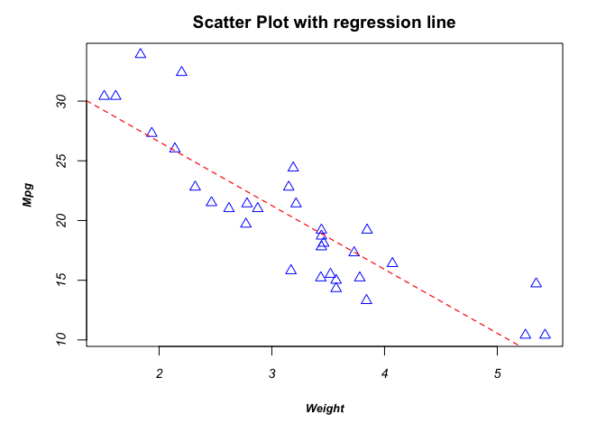

Basic Visualization
================
Sumad Singh
September 7, 2017

### BASIC GRAPHIC SYSTEM IN R

### PARAMETERS TO ANNOTATE GRAPHS

### COMBINE GRAPHS

``` r
## USING BASIC GRAPHIC SYSTEM IN R
#1.LAYERING 
#We want to build layers of plots on a single chart, R provides a system to do that
#help("dev.cur")
# IDEA IS TO OPEN A GRAPHICS DEVICE, R ALLOWS TO OPEN MULTIPLE DEVICES,
# DIRECT OUTPUT TO A CHOICE OF DEVICE
# FUNCTIONS LIKE PDF(), PNG(), JPEG() OPEN A DEVICE BY THEMSELVES
# HIGH LEVEL FUNCTIONS LIKE PLOT(), HIST() ETC ALSO OPEN A DEVICE

# USEFUL FUNCTIONS FOR OPENING AND MANAGING DEVICES
# a Null device is always open in a session, once a new device is opened Null does not show up
#dev.new() # Open a new device, 
# dev.cur() # lists the name and number of current active device
# dev.list() # lists the names and mumbers of all open devices
# dev.off() # shuts off a device
# dev.next() # shuffle to next device w.r.t the current
# dev.previous() # same, goes to previous
# graphics.off()  # closes all open devices

# EXAMPLE OF PLOTTING A SCATTER PLOT, AND A REGRESSION LINE
attach(mtcars)
dev.new()
plot(x = hp ,y = mpg,type = "p") # PLOT IS A HIGH LEVEL FUNCTION IN R, WHICH CAN MAKE DIFFERENT TYPE OF PLOTS
# BASED ON THE 'TYPE' ARGUMENT
abline(reg = lm(mpg~hp))
detach(mtcars)
#help(abline)
```

``` r
#2. KEY PLOTTING FUNCTIONS
# 2.1 PLOT
#PLOT FUNCTION WORKS DIFFERENTY ON OBJECTS LIKE DATA FRAMES, DENSITY, PLOT.DEFAULT WORKS 
#FOR SCATTERPLOT B/W X AND Y
attach(mtcars)
plot(x= hp, y= mpg,type = "p",xlab = "log (horsepower)",ylab = "log(Miles per gallon)",log = "xy" ,main = " Log Linear relationship?"  ,
     sub =  "log mpg vs log hp" ,frame.plot = TRUE,asp = 1)
```



``` r
# 2.2 
#lines()

#2.3 
#abline(v = seq()) can give horizontal and vertical points where to draw lines


detach(mtcars)
# xlim, ylim are limits on the axes
# main title
# sub - subtitle of the plot
# xlab/ylab -  x , y axis labels
# axes - used "xaxt" or "yaxt to suppresss one of thre axes"
# frame.plot - logical to choose if plot to be enclosed in a box
# asp - aspect ration i.e y/x
```

``` r
# Plot function operates on a data frame with all numeric columns to give
# bivariate scatter plots
plot(mtcars)
```


``` r
#3. GRAPHICAL PARAMETERS - COLOR, LINE/POINT/BAR TYPE, LENGTH,WIDTH ,TEXT ETC
#A. GENERAL FUNCTION TO SPECIFY GRAPHICAL PARAMETERS
#par() # return a list of current graphical paramters
par.default <- par(no.readonly = TRUE) # return the current setting of parameters that can be modified, use of no.readonly=T
par(lty = 2, lwd = 2, pch= 2 ,cex= 1.2) # new settings
attach(mtcars)
plot(x= hp, y= mpg,type = "p",xlab = "horsepower",ylab = "Miles per gallon" ,main = " Linear relationship?"  ,
     sub =  "mpg vs hp" ,frame.plot = TRUE)
abline(reg = lm(mpg ~ hp))
```


``` r
detach(mtcars)
par(par.default) # return to original settings


#B. GRAPHICAL PARAMETERS WITHIN HIGH LEVEL FUNCTIONS (NOT ALL ARE AVAILABLE THOUGH!, 
#SO USE A OPTION AS NEEDED )
# plot() and abline() for example have ... argument to specify graphical parameters,
# these settings are used only for the current plot
```

### GRAPHICAL PARAMETERS SUMMARY

<table style="width:22%;">
<colgroup>
<col width="5%" />
<col width="5%" />
<col width="5%" />
<col width="5%" />
</colgroup>
<thead>
<tr class="header">
<th>GEOM</th>
<th>PARAMETER/AESTHETIC</th>
<th>KEYWORD USED FOR SETTING AESTHETIC FOR GEOM</th>
<th>REALIZATION-AES.GEOM</th>
</tr>
</thead>
<tbody>
<tr class="odd">
<td>TEXT - TITLE, SUBTITLE,AXIS LABELS,AXIS VALUES</td>
<td>FONT FAMILY,FONT,SIZE,COLOUR</td>
<td>family,font,cex,col</td>
<td>family,</td>
</tr>
<tr class="even">
<td>font.main, font.sub, font.lab, font.axis AND col.main, col.sub etc AND cex.main, cex.sub etc</td>
<td></td>
</tr>
<tr class="odd">
<td>POINT</td>
<td>SIZE, TYPE</td>
<td>cex,pch</td>
<td>cex, pch</td>
</tr>
<tr class="even">
<td>LINE</td>
<td>TYPE, WIDTH</td>
<td>lty,lwd</td>
<td>lty,lwd</td>
</tr>
<tr class="odd">
<td>PLOT DIM</td>
<td>DIM</td>
<td>dim(wdth,hght)</td>
<td>same</td>
</tr>
<tr class="even">
<td>MARGIN</td>
<td>MARGIN IN INCHES OR LINES</td>
<td>mar(vector of 4) or mai(vector of 4)</td>
<td>same</td>
</tr>
</tbody>
</table>

``` r
#C.  PARAMETERS FOR POINT AND LINES
# pch -  point type, goes from 0 to 24
# cex - size zooming relative to default of 1, expressed as 1.<x>
# lty - line type goes from 1 to 6
# lwd - line width ,elative to default of 1, expressed as 1.<x>

# D. PARAMETERS FOR COLORS
# col - color of lines or points in the plot, can be given as a vector, the values of which are recycled
# col.axis - color of axes
# col.lab - color of label of axes
# col.main , col.sub 
#fg, bg - foreground and background color

# FUNCTIONS TO GET A VECTOR OF COLORS, COLORS CAN BE SPECIFIED AS NAMES, OR DIGITS
#OR HEXADECIMALS
x <- colors(5)
y <- rainbow(5)
z <- heat.colors(5)
cvec <- c(rgb(0.2,1,0.5), rgb(0.5,1,0),rgb(0.5,0.5,0.2),rgb(0.1,0.3,0.4),rgb(0.4,.2,0.1)) 
# rgb lets you create  vector of colors using red green blue
hvec <- c(hsv(0.2,1,0.5), hsv(0.5,1,0),hsv(0.5,0.5,0.2),hsv(0.1,0.3,0.4),hsv(0.4,.2,0.1))
# hsv is another function
pie(x = c(100,20,30,40,10),radius = 1 ,clockwise = TRUE ,col = y ,labels = y)
```


``` r
# function to create a pie chart
```

``` r
#E. PARAMETERS FOR TEXT -
#SIZE : params for font size
# cex - specify how much text enlargement is needed for plotted text
# same paramter govern point size
# cex. axis - for text on the axis
# cex.lab - axes labels
# cex.main - main title
# cex.sub - subtitle


#FONT FAMILY, STYLE
# family - for drawing text,
  #by default there are three families - serif, sans, mono
# font - integer for specifying bold  -2, italic-3 ,plain - 1, bold italic - 4  
 # for plotted text
# font. axis - for text on the axis, i.e values marked on axes
# font.lab - axes labels
# font.main - main title
# font.sub - subtitle

# ps - font point size (1/72 inch). text size =  cex * ps


#F. GRAPH DIMESNIONS AND MARGINS
#pin(width, height) to fix plot dimensios in inches
#mar() - vector of 4 to fix margins in lines in order (bottom, left, top, right) 
#mai() - same but this is in inches, default  is c(5,4,4,2) + 0.1 

# Example , draw a simple scatter and line chart 
# fix dim of plot, fix margins, note the margins are taken from the plot are and out
attach(mtcars)
par.default <- par(no.readonly = TRUE)
par(pin=c(5,3), mai = c(1,1,0.5,0.5)) # 33% of y dim as margin in bottom, 20% on left

# fix point type/size,
# Font family, font bolded for title, italics for axis, bold italics for labels
plot(x = wt, y= mpg, type = "p" ,main = "Scatter Plot with regression line" ,
     frame.plot = TRUE, pch = 2,col= "blue",xlab = "Weight", ylab = "Mpg",
     font.axis = 3, font.main = 2,font.lab = 4, 
     cex = 1.2, cex.main = 1.2, cex.lab= 0.8, cex.axis = 0.9)

# fix color/type/width of line
abline(reg=lm(mpg~wt), lty = 2, lwd = 1.2, col ="red")
```



``` r
detach(mtcars)
par(par.default)
```

``` r
# G. ADDING TEXT ON CHART, LEGENDS, CUSTOMIZING AXES SEPARATELY
# Only some of the high level functionslike plot() let you specify
# the graphical parameters, in other cases separate function can be used

#G.1 TITLE LETS setting OF TEXT RELATED AESTHETICS LIKE 
# TEXT SIZE, FONT, COLOR, FAMILY
#title(main = ,sub = ,xlab = ,ylab = , # Adding titles - main, sub, labels
#      col.main =,col.sub, col.lab =,  # Adjust color
#      cex.main =, cex.sub, cex.lab)  # Adjust size

#G.2 AXIS LETS CUSTOMIZATION OF AXES
# USE TO DRAW GRAPHS WITH MORE THAN 2 AXES
#PLOTS ONE AXIS AT A TIME
# axis(side = ,    which side of the plot to draw axis (1-b,2-l,3-u,4-r)
#      at = ,  num vector, where to put tick marks on the axis
#      labels = ,  char vec, what labels to give to ticks
#      tick = , length of tick as fraction of plotting area
#      pos = ,  point on the other axis where it crosses
#      font = ,
#      las = labels parallel or perpendicular to axis
#      lty = ,lwd = ,lwd.ticks = ,col = ,col.ticks = )

# G.3 USING MINOR TICKS IN A PLOT from Hmisc library
# library(Hmisc)
# minor.tick(nx = , ny = , no. of intevals to divide major ticks in on x and y axis
#            tick.ratio = ) size of minor tick to major tick

# G.3 LEGEND, KEY PARAMS
# legend(x= ,y = , # coordinates of legend or use xy.legend and "left", "right" etc
#        legend = , # charcter vectot of labels 
#        fill = ,# causes boxes to be filled besides legend text
#        col = , # cause color of point or lines appearing besdides text
#        pch = ,lty = ,lwd = , point or line attributes appearing the legend
#        bty = ,bg =  box type, background color
#        box.lwd = ,box.lty = ,box.col = )
```
