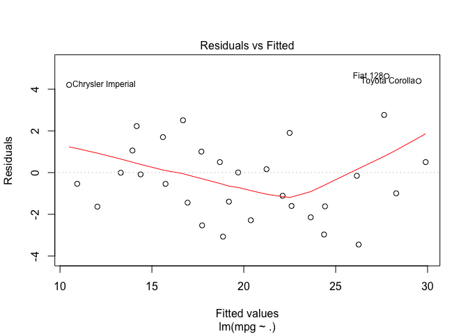
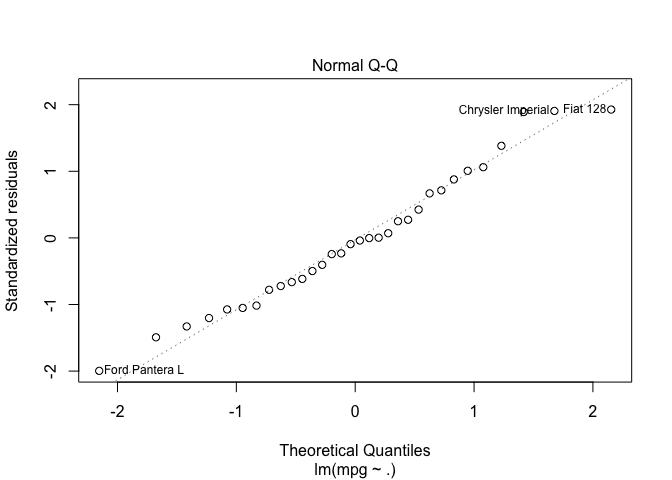
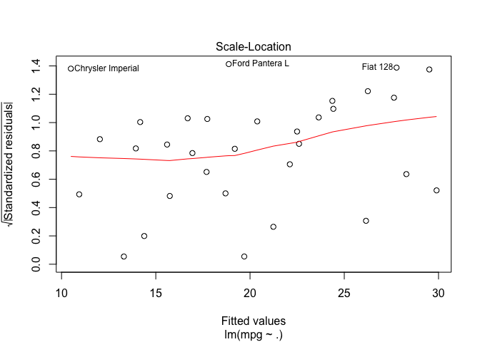
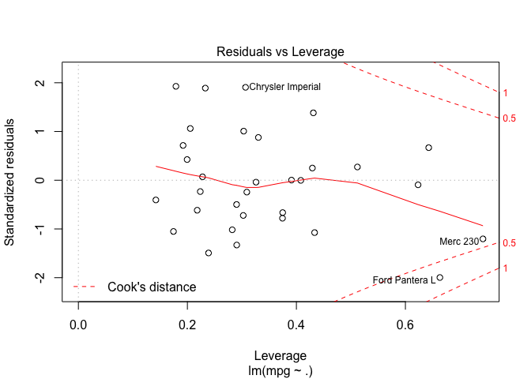
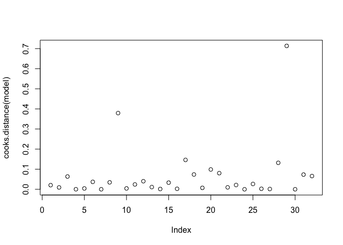

RIA Ch1
================

\#\# SEARCHING IN R
-------------------

``` r
options(echo=FALSE, eval = FALSE)
# GETTING HELP
# help.start()
# GET Amazing links that include
#1. An introduction to R from CRAN  -- VERY VALUABLE RESOURCE
#2.A Search Engine 
#3. User Manuals, Technical Papers
#4. Mailing lists by SIGs (Special Interest Groups)
# 5. list out of packages and so on..

#The R Studio home also offer a lot of useful information -
 # 1. R Cheat Sheets for R Studio packages. 
 #  2. Learning R Online etc
 
#RSiteSearch("probability distributions")
# The power of searching on Rsite is that it gives a full view of tasks list 
#where the referecnes could be found.
# Instead of a google search, this is more relevant. One can see functions, 
#packages, NEWS, if the packages has
#vignettes to refer to etc.

data()
# Gives summary of data sets of all loaded packages, can make it specific by giving 
# packagename as an argument

vignette()

# Gives the vignettes of all available loaded packages in the session. Example of data.table - 
# datatable-reshape                Efficient reshaping using data.tables (source, html)
# datatable-faq                    Frequently asked questions (source, html)
# datatable-intro                  Introduction to data.table (source, html)
# datatable-keys-fast-subset       Keys and fast binary search based subset (source, html)
# datatable-reference-semantics    Reference semantics (source, html)
# datatable-secondary-indices-and-auto-indexing
#                                  Secondary indices and auto indexing (source, html)
                                 
#vignette("datatable-intro")  

#apropos("poisson",mode = "function")
# Lets you do a string search and return functions that have the string name
```

\#\# HANDLING WORKSPACE
-----------------------

``` r
# REMOVE  OBJECTS by passing them to argument list
rm(list = ls())
# GLOBAL OPTIONS, and setting an option
help("options")
# SAVING AND RETREIVING COMMAND HISTORY :Get a hitory of commands typed on command line
#history(max.show = 25) 
#savehistory() # used to save history of commands, the default file where command history 
#is saved is .Rhistory
#loadhistory()
# SAVING WORKSPACE and LOADING WORKSPACES
#save.image() # Used to save the workspace i.e packages loaded, objects created etc. The default file saved to
#is .RData
#load()
```

------------------------------------------------------------------------

CONNECTIONS AND REDIRECTING OUTPUT
----------------------------------

``` r
# DIRECTORY OPERATIONS
# Create a directory and assign permissions using 4 digits like "0777"
#dir.create(path= , mode = )
#dir.exists()

# FILE PATH 
# faster than paste, and do not need to specify separators
#file.path()

# CONNECTION TO A FILE

# con <- file(description = ,open = ,) giving a file name and one of the common modes i.e "r" , "w" ,"a" opens as well as

# DIRECTING TEXT OUPTPUT
#sink(file =, append =,split = ,type =  ) directs text output to a connection as well stops, either append or overwrite
# These connections are open with every R session - stdout, stderr.
#message(), warning(), stop() send output to stderr(). sink(type= "output") directs output from stdout() to a connection 
#you open or sink(type= "message") diverts output from stderr()
sink(file = "test.log" , append = "true",type = "output") # sink also opens a connection 
cat("test if log file is creted","\n")
```

    ## test if log file is creted

``` r
sink()

# OPENING CONNECTION TO GRAPHICS DEVICES
# pdf(), jpeg(), png() open the connection 
# dev.off() closes the connection
```

PACKAGES
--------

``` r
# BASE PACKAGES
# The install comes with base packages 
options()$defaultPackages
```

    ## [1] "datasets"  "utils"     "grDevices" "graphics"  "stats"     "methods"

``` r
# "datasets"  "utils"     "grDevices" "graphics"  "stats"     "methods" 

# NEW PACKAGES
# Use install.packages()
# Choose cran mirror

# LIBRARY WITH PACKAGES
# The path of library/ies in use is listed as
.libPaths()
```

    ## [1] "/Library/Frameworks/R.framework/Versions/3.4/Resources/library"

``` r
# Packages saved in the library are listed with
library()

# update.packages() Updated package 


# LOADED/ATTACHED PACKAGES
search()
```

    ## [1] ".GlobalEnv"        "package:stats"     "package:graphics" 
    ## [4] "package:grDevices" "package:utils"     "package:datasets" 
    ## [7] "package:methods"   "Autoloads"         "package:base"

``` r
# LEARNING ABOUT A PACKAGE
help(package = stats) # lists out all the functions in the package
data(package= "car") # summary of all dats sets in the package
```

CUSTOMIZING START UP ENVIRONMENT
--------------------------------

``` r
# ENVIRONMENT VARIABLES
# R_HOME = Default home where R's installation resides
# HOME - Default home directory of thre user
# List of Environment variables is given by Sys.getenv()

# Behavior of R on start up is given in detail in 'Introduction to R'. Use  help(Startup) 
# Rprofile.site - When R session starts, this file, if exists is executed from R_HOME/etc location
# .Rprofile - This file is executed from getwd() , if not found  then looked at HOME/

# Check if the file exists
file.exists(file.path(Sys.getenv("R_HOME"),"etc",".Rprofile"))
```

    ## [1] FALSE

``` r
# .FIRST() and .LAST()
# Functions that can be created in any of these files, that are executed at the start and at the end of session resp.

# Summary of uses
# Load packages at start, clean up objects at the end, or save command history
# Create shortcuts for use of some commands
# Load often used user defined functions, by sourcing a file with those functions
# Setting up some global options with prefered values
# Setting up a custom library path
```

NOINTERACTIVE MODE OR BATCH MODE
--------------------------------

``` r
# COMMAND structure 
# R CMD BATCH <options> infile outfile
# infile - an executable file .R
# outfile - where utputs go , a .Rout extension file

# OPTIONS
# optparse() is a package usefule to pass command line variables
# Section command lne options in 'CRAN's Introduction to R' has more details on available options
```

USING OUTPUTS AS INPUT
----------------------

``` r
help(mtcars)
str(mtcars)
```

    ## 'data.frame':    32 obs. of  11 variables:
    ##  $ mpg : num  21 21 22.8 21.4 18.7 18.1 14.3 24.4 22.8 19.2 ...
    ##  $ cyl : num  6 6 4 6 8 6 8 4 4 6 ...
    ##  $ disp: num  160 160 108 258 360 ...
    ##  $ hp  : num  110 110 93 110 175 105 245 62 95 123 ...
    ##  $ drat: num  3.9 3.9 3.85 3.08 3.15 2.76 3.21 3.69 3.92 3.92 ...
    ##  $ wt  : num  2.62 2.88 2.32 3.21 3.44 ...
    ##  $ qsec: num  16.5 17 18.6 19.4 17 ...
    ##  $ vs  : num  0 0 1 1 0 1 0 1 1 1 ...
    ##  $ am  : num  1 1 1 0 0 0 0 0 0 0 ...
    ##  $ gear: num  4 4 4 3 3 3 3 4 4 4 ...
    ##  $ carb: num  4 4 1 1 2 1 4 2 2 4 ...

``` r
model <- lm( formula = mpg ~ ., data = mtcars)
# Model is the output, we can use it as an input with some function
```

``` r
summary(model)
```

    ## 
    ## Call:
    ## lm(formula = mpg ~ ., data = mtcars)
    ## 
    ## Residuals:
    ##     Min      1Q  Median      3Q     Max 
    ## -3.4506 -1.6044 -0.1196  1.2193  4.6271 
    ## 
    ## Coefficients:
    ##             Estimate Std. Error t value Pr(>|t|)  
    ## (Intercept) 12.30337   18.71788   0.657   0.5181  
    ## cyl         -0.11144    1.04502  -0.107   0.9161  
    ## disp         0.01334    0.01786   0.747   0.4635  
    ## hp          -0.02148    0.02177  -0.987   0.3350  
    ## drat         0.78711    1.63537   0.481   0.6353  
    ## wt          -3.71530    1.89441  -1.961   0.0633 .
    ## qsec         0.82104    0.73084   1.123   0.2739  
    ## vs           0.31776    2.10451   0.151   0.8814  
    ## am           2.52023    2.05665   1.225   0.2340  
    ## gear         0.65541    1.49326   0.439   0.6652  
    ## carb        -0.19942    0.82875  -0.241   0.8122  
    ## ---
    ## Signif. codes:  0 '***' 0.001 '**' 0.01 '*' 0.05 '.' 0.1 ' ' 1
    ## 
    ## Residual standard error: 2.65 on 21 degrees of freedom
    ## Multiple R-squared:  0.869,  Adjusted R-squared:  0.8066 
    ## F-statistic: 13.93 on 10 and 21 DF,  p-value: 3.793e-07

``` r
# Diagnostic plots using plot() on the model object
plot(model)
```



``` r
cooks.distance(model = model)
```

    ##           Mazda RX4       Mazda RX4 Wag          Datsun 710 
    ##        2.059098e-02        9.218355e-03        6.352411e-02 
    ##      Hornet 4 Drive   Hornet Sportabout             Valiant 
    ##        1.306707e-04        4.083138e-03        3.697080e-02 
    ##          Duster 360           Merc 240D            Merc 230 
    ##        6.907413e-05        3.454201e-02        3.792206e-01 
    ##            Merc 280           Merc 280C          Merc 450SE 
    ##        4.282385e-03        2.404482e-02        4.013729e-02 
    ##          Merc 450SL         Merc 450SLC  Cadillac Fleetwood 
    ##        1.101611e-02        1.412179e-03        3.307570e-02 
    ## Lincoln Continental   Chrysler Imperial            Fiat 128 
    ##        2.411065e-03        1.461259e-01        7.356371e-02 
    ##         Honda Civic      Toyota Corolla       Toyota Corona 
    ##        7.045139e-03        9.860340e-02        8.026150e-02 
    ##    Dodge Challenger         AMC Javelin          Camaro Z28 
    ##        9.609258e-03        2.124258e-02        5.466773e-07 
    ##    Pontiac Firebird           Fiat X1-9       Porsche 914-2 
    ##        2.647385e-02        2.467984e-03        1.329399e-03 
    ##        Lotus Europa      Ford Pantera L        Ferrari Dino 
    ##        1.316870e-01        7.135206e-01        5.198424e-07 
    ##       Maserati Bora          Volvo 142E 
    ##        7.309138e-02        6.581417e-02

``` r
plot(cooks.distance(model))
```


