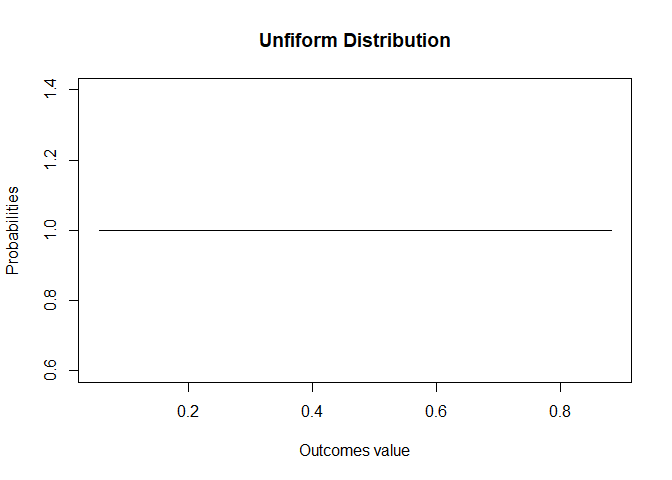
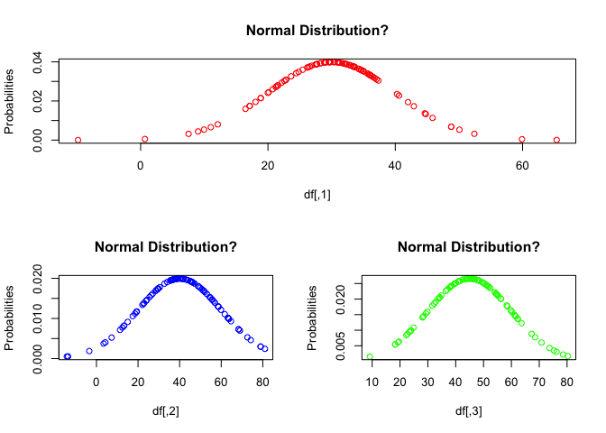

Advanced Data Wrangling
================
Sumad Singh
September 17, 2017

``` r
# COMMON MATHEMATICS FUNCTIONS  
# THESE FUNCTIONS ARE VECTORIZED, I.E THEY WORK ON SCALARS, VECTOTS, DATA FRAMES
# sqrt()
# abs()
# floor()
# ceiling()
# trunc(34.99)
# round(34.993,digits =2 ) digits after decimal
# signif(34.993, digits = 4) significant digits
#cos(), sin(), tan() trig functions
#log(x = ,base = ) , log (x) is natural log
#exp(x)
```

``` r
# STATISTICS FUNCTIONS
# CENTRAL TENDENCY
temp <- c(20,25,11,35,60, 25,11)
sort(temp)
```

    ## [1] 11 11 20 25 25 35 60

``` r
mean(x = temp,trim = 0.05 ,na.rm = TRUE ) # can get trimmed mean after specifying a fraction
```

    ## [1] 26.71429

``` r
 # of observations to be trimmed from each end
median(x = temp,na.rm = TRUE )
```

    ## [1] 25

``` r
# DEVIATION
mad(x = temp) # MEDIAN OF ABSOLUTE DEVIATIONS
```

    ## [1] 14.826

``` r
sd(x = temp,na.rm = TRUE )
```

    ## [1] 16.93826

``` r
var(x = temp)
```

    ## [1] 286.9048

``` r
min(x = temp)
```

    ## [1] 11

``` r
max(x = temp)
```

    ## [1] 60

``` r
range(temp)
```

    ## [1] 11 60

``` r
IQR(temp)
```

    ## [1] 14.5

``` r
# RANK/POSITION
quantile(x = temp,probs = c(0.25,0.5,0.75,1)) # creates approx. quantiles
```

    ##  25%  50%  75% 100% 
    ## 15.5 25.0 30.0 60.0

``` r
# like 25%ile is not 11+ 25%  (20-11) 

# LAGGED SERIES
diff(temp,    # Used to create lagged series, given a vector
     lag = 1 , # order of lag
     differences = 2) # order of difference
```

    ## [1] -19  38   1 -60  21

``` r
# CENTERING AND SCALING : scale() function
# IN GENERAL CENTERING A VARIABLE MEANS SUBTRACTING MEAN VALUES FROM ALL IT' VALUES,
# SCALING MEANS DIVIDING BY STANDARD DEVIATION

scale(x = temp,   # CAN OPERATE ON EACH COLUMN OF A MATRIX LIKE OBJECT
      center = TRUE, # EITHER LOGICAL OR NUMERIC VECTOR WITH VALUES TO USE FOR CENTERING INSTEAD OF MEAN
      scale = TRUE) # EITHER LOGICAL OR NUMERIC VECTOR WITH VALUES TO USE FOR SCALING.
```

    ##            [,1]
    ## [1,] -0.3963975
    ## [2,] -0.1012079
    ## [3,] -0.9277389
    ## [4,]  0.4891714
    ## [5,]  1.9651197
    ## [6,] -0.1012079
    ## [7,] -0.9277389
    ## attr(,"scaled:center")
    ## [1] 26.71429
    ## attr(,"scaled:scale")
    ## [1] 16.93826

``` r
   # IF CENTER IS TRUE, STD. DEVIATION IS USED FOR SCALING, ELSE RMS IS USED

# MOVING A SERIES TO A DESIRED MEAN AND STANDARD DEVIATION
#STEP1: STANDARDIZE THE SERIES using Z STATISTIC
#STEP 2: MULTIPLE SERIES BY DESIRED SD ( THIS DOES NOT CHANGES THE MEAN), 
#THEN ADD THE DESIRED MEAN TO SERIES (THIS DOES NOT CHANGES THE SD)

# PRPOERTY 1 :TO MOVE MEAN OF A SERIES BY K, ADD K TO EACH NUMBER, NOTE THAT THIS DOES NOT CHANGE THE SD
mean(temp)
```

    ## [1] 26.71429

``` r
mean(temp+5)  
```

    ## [1] 31.71429

``` r
sd(temp)
```

    ## [1] 16.93826

``` r
sd(temp+5)  
```

    ## [1] 16.93826

``` r
# PROPERTY 2: TO MAKE THE SD OF A SERIES K TIME, MULTIPLY THE SERIES BY K. MEAN ALSO BECOMES K TIMES 
sd(temp)
```

    ## [1] 16.93826

``` r
 sd(2*temp)
```

    ## [1] 33.87653

``` r
 mean(temp)
```

    ## [1] 26.71429

``` r
 mean(2*temp)
```

    ## [1] 53.42857

``` r
# EXAMPLE OF MOVING SERIES TO A MEAN OF 10 AND SD OF 5 
  
temp.new <- scale(x = temp,center = TRUE, scale = TRUE)
temp.new2 <- temp.new * 5 + 10
mean(temp.new2)  
```

    ## [1] 10

``` r
sd(temp.new2)  
```

    ## [1] 5

``` r
# PROBABILITY FUNCTIONS
# DISCRETE AND CONTINUOUS PROBABILITY DISTRIBUTIONS ARE AVAILABLE in R
# 4 TYPES OF FUNCTIONS, THEIR FORM IS - <d/p/q/r><distribution name>, with dpqr meaning and use as below

#d - DENSITY FUNCTION TO GET POINT/ APPROX POINT PROBABILITIES
#r - RANDOM NUMBERS FROM A DISTRIBUTION
set.seed(100)
x <- sort(rnorm(30,10,2)) # RANDOM NUMBERS THAT ARE NORMALLY DISTRIBUTRED 
y <- dnorm(x = x, mean = 10, sd = 2) # APPROXIMATE POINT PROBABILITIES FOR GIVEN X VALUES
plot(x = x,y = y,type = "l", xlab = "Outcomes value",ylab = "Probabilities",main = "Normal Distribution")
```


``` r
#p - CUMULATIVE PROBABILITY FUNCTION
# WHAT IS PROBABILITY for VALUE LESS THAN 2 SD FROM MEAN
pbs <- pnorm(q = c(6,14) ,mean = 10, sd = 2,lower.tail = TRUE)
pbs[2]-pbs[1]
```

    ## [1] 0.9544997

``` r
#q -  WHAT IS THE VALUE OF X FOR WHICH PROB. IS LESS THAN 97.75% OR
# WHAT IS THE VALUE OF X FOR 97.75%ILE VALUE OF A NORMAL DISTRIBUTION
qnorm(p = 0.9775 ,mean = 10 ,sd = 2,lower.tail = TRUE )
```

    ## [1] 14.00931

``` r
# GENERATE A STANDARD NORMAL DENSITY DISTRIBUTION
x <- seq(from = -3, to = 3, by = 0.02)
y <- dnorm(x = x,mean = 0,sd = 1)
plot(x = x,y = y,type = "l", xlab = "Outcomes value",ylab = "Probabilities",main = "Standard Normal")
```


``` r
# PSEUDO RANDOM NUMBER GENERATION
set.seed(100)
ns <- sort(runif(n=20,min = 0, max = 1))
probs <- dunif(x = ns)
plot(x = ns,y = probs,type = "l", xlab = "Outcomes value",ylab = "Probabilities",main = "Unfiform Distribution")
```



``` r
# MULTIVARIATE NORMAL DISTRIBUTION
# GENERATE N NORMAL VARIABLES, GIVEN MEANS AND COVARIANCE MATRIX
library(MASS)
set.seed(100)
mean <- c(30,40,45)
# COVARIANCE MATRIX
cov.mat <- matrix(nrow = 3,ncol = 3, data = c(100,-85, -90,
                                             -85,400,200,
                                              -90,200,225))  

df <- mvrnorm(n = 100 ,mu = mean  ,Sigma = cov.mat)

# VALIDATE THE VARIABLES ARE NORMALLY DISTRIBUTED
y1 <- dnorm(x = df[,1], mean = 30, sd = 10)
y2 <- dnorm(x = df[,2], mean = 40, sd = 20)
y3 <- dnorm(x = df[,3], mean = 45, sd = 15)

layout(mat = matrix(nrow = 2,ncol =2 ,data = c(1,1,2,3),byrow = TRUE))
plot(x = df[,1],y = y1,type = "p", xlab = "df[,1]",ylab = "Probabilities",
     main = "Normal Distribution?", col ="red")
plot(x = df[,2],y = y2,type = "p", xlab = "df[,2]",ylab = "Probabilities",
     main = "Normal Distribution?", col = "blue")
plot(x = df[,3],y = y3,type = "p", xlab = "df[,3]",ylab = "Probabilities",
main = "Normal Distribution?" , col = "green")
```



### TABLE OF COMMON PROBABILITY DISTRIBUTIONS

| No  | DISTRIBUTION NAME | FUNCTION |
|-----|-------------------|----------|
| 1   | normal            | norm     |
| 2   | uniform           | unif     |
| 3   | binomial          | binom    |
| 4   | negative binomial | nbinom   |
| 5   | Exponential       | exp      |
| 6   | Poisson           | pois     |
| 7   | Gamma             | gamma    |
| 8   | Weibull           | weibull  |
| 9   | lognormal         | lnorm    |
| 10  | logistic          | logis    |
| 11  | T                 | t        |
| 12  | Chi square        | chisq    |
| 13  | F                 | f        |
| 14  | Geometric         | geom     |
| 15  | Hypergeometric    | hyper    |
| 16  | Cauchy            | cauchy   |
| 17  | Beta              | beta     |

``` r
# PRINT AND CAT - DIFFERENCES AND WHEN TO USE WHAT
# PRINT() CALLS A METHOD BASED ON THE CLASS OF THE OBJECT GIVEN AS ARGUMENT, AND RETURNS AN OBJECT 
# OF THE SAME CLASS
class(print(1:3))
```

    ## [1] 1 2 3

    ## [1] "integer"

``` r
class(print(c("a","b")))
```

    ## [1] "a" "b"

    ## [1] "character"

``` r
# CAT() INTERNALLY TRIES TO CONVERT THE ARGUMENT/S TO CHARATCER VECTOR, CONCATENATEs
# AND OUTPUTS TO CONSOLE OR A FILE.IT CANNOT ON ACT ON COMPLEX OBJECTS LIKE LISTS,
# DATA FRAMES. IT IS VALID ONLY FOR ATOMIC DATA TYPES
# ALSO RETURNS OBJECT OF CLASS NULL, OUTPUT APPEARS CLEAN
#print()
#cat(... = ,file = ,fill = ,append = )
class(cat(1:3))
```

    ## 1 2 3

    ## [1] "NULL"

``` r
class(cat(c("a","b")))
```

    ## a b

    ## [1] "NULL"

``` r
# WHEN TO USE WHICH
#1.  USE CAT TO USE ESCAPE SEQUENCES: USING ESCAPE SEQUENCES IN CAT() MEANS, THEY ARE NOT RETURNED AS
# CHARACTER VECTORS AND ARE BROUGHT TO EFFECT BY CAT, BUT NOT BY PRINT
#2. USE CAT TO WRITE TO LOG FILES, MAKING USE OF ESCAPE SEQUENCES. OR USE IT'S UNFORMATTED OUTPUT
# TO COPY IT OVER TO OTHER PLACES
#3. USE PRINT WITH NON -ATOMIC CLASSES
```

``` r
# SPECIAL CHARACTERS, ESCAPE SEQUENCES, NON-STANDARD NAMING OF VARIABLES

#1. SPECIAL CHARACTERS AND ESCAPE SEQUENCES
# SPECIAL CHARACTERS : \ and "  HAVE RESERVED INTERPRETATION IN R, FOR THESE TO BE USED
# IN LITERAL SENSE IN CHARACTER VECTORS, EACH OF THEM NEED TO BE ESCAPED WITH A '\'

# x <- c("\", "'", """) # will throw an error
#x <- c("\m", "'") # will throw an error that \m is unrecognized esc seq
x <- c("\\", "'", "\"", "\\m") 
print(x) # RETURNS A CHARACTER VECTOR
```

    ## [1] "\\"  "'"   "\""  "\\m"

``` r
cat(x) # RETURNS A NULL CLASS OBJECT, YOU CAN SEE THE CHARACTERS PLANLY AS YOU WOULD ON
```

    ## \ ' " \m

``` r
# KEYBOARD INPUT

# ESCAPE SEQUENCES:

# \n, \t, \b, \r, \f, \v have ascribed MEANINGS for keyboard inputs
# AND WITH ONLY THESE, CAN '\' BE USED IN CHARACTER STRINGS
#print("\s") # gives error
print("\n")
```

    ## [1] "\n"

``` r
# EXAMPLES OF USING SPECIAL CHARACTER AND ESCAPE SEQUENCES:
# x <- "In ALGOL, you could do logical AND with /\."
# throws an error, because '\' character is interpreted as a special character
# in R, to use it as a normal character have to backlash it.

x <- "In ALGOL, you could do logical AND with /\\."
print(x)
```

    ## [1] "In ALGOL, you could do logical AND with /\\."

``` r
cat(x) 
```

    ## In ALGOL, you could do logical AND with /\.

``` r
class(writeLines(x)) # writelines also returns object of null class
```

    ## In ALGOL, you could do logical AND with /\.

    ## [1] "NULL"

``` r
# SEE THE DIFFERENCE IN THE TWO OUTPUTS FROM CAT
y <- c("tab:\\t", "newline:\\n", "escape:\\", "arbitrary string:\\s")
print(y)
```

    ## [1] "tab:\\t"              "newline:\\n"          "escape:\\"           
    ## [4] "arbitrary string:\\s"

``` r
cat(y)
```

    ## tab:\t newline:\n escape:\ arbitrary string:\s

``` r
sub(pattern = "\\s",replacement = "." ,x = "hello there")
```

    ## [1] "hello.there"

``` r
y <- c("tab:\t", "newline:\n", "escape:\\", "arbitrary string:\\s")
print(y)
```

    ## [1] "tab:\t"                "newline:\n"           "escape:\\"           
    ## [4] "arbitrary string:\\s"

``` r
cat(y)
```

    ## tab:  newline:
    ##  escape:\ arbitrary string:\s

``` r
# USING QUOTES IN THE FINAL OUTOUT ON CONSOLE OR A FILE
x <- "My name is \"Sumad\""       
print(x)
```

    ## [1] "My name is \"Sumad\""

``` r
cat(x)
```

    ## My name is "Sumad"

``` r
#2. NON STANDARD NAMES - USE OF ``

`x y` <- 1:5
`x y`
```

    ## [1] 1 2 3 4 5

``` r
# COMMON STRING AND CHARACTER MANIPULATION FUNCTIONS

vec <- c("Hello", "it has been very long and \\s slow going!" ,"Can we make itt fast??")
#1. nchar()
nchar(vec)  # length(vec[2]) will not count characters
```

    ## [1]  5 40 22

``` r
nchar(" ") # space is a character
```

    ## [1] 1

``` r
#2. substr()
# SUBSTR() LETS YOU ACCESS A STRING (SCALAR CHARACTER), AND CARVE OUT A SUBSTRING

# EXAMPLE : TO PICK THE SUBSTRING '\\S' FROM VEC[2]
vec[2] # IS A SCALAR, SO YOU CANNOT INDEX AND ACCESS IT'S PARTS
```

    ## [1] "it has been very long and \\s slow going!"

``` r
split.bbones <- strsplit(x = vec[2], # FIRst split the scalar string
                         split = "", # to its constituting characters
                         fixed = TRUE) # to form a vector
#str(split.bbones)
ind <- grep(pattern = "\\",              # Access the vector and find matching
            value = FALSE, fixed = TRUE, # index for "\\", note that "\\"
            x = split.bbones[[1]])       # was broken to be a single character

# now pass the indices to substr()
substr(x = vec[2] ,start = ind ,stop = ind +1 ) # takes a start and stop index
```

    ## [1] "\\s"

``` r
#3. grep  # Search a pattern and return the positions/values from the vecor
# where match was found 
grep(pattern = "\\",             # Pattern can be specified using reg. expressions
    value = FALSE,               # the default behavior expexts reg. exp.
    fixed = TRUE,                # index or value can be returned, fixed = TRUE
    x = split.bbones[[1]],        # ensure pattern is treated as normal string 
    ignore.case = TRUE ,
    invert = FALSE,               # can get non -matching index or values also
    perl = TRUE)                  # if perl compatibel reg ex should be used
```

    ## Warning in grep(pattern = "\\", value = FALSE, fixed = TRUE, x =
    ## split.bbones[[1]], : argument 'ignore.case = TRUE' will be ignored

    ## Warning in grep(pattern = "\\", value = FALSE, fixed = TRUE, x =
    ## split.bbones[[1]], : argument 'perl = TRUE' will be ignored

    ## [1] 27

``` r
#4. sub , gsub # Find a pattern and substitie, can do global search and replace
sub(pattern = "\\s",
    replacement = "",x = vec[2],
    ignore.case = FALSE,perl = FALSE ,
    fixed = TRUE ) # WITH FIXED = TRUE THE METACHARCTER '\' LOOSES IT'S MEANING
```

    ## [1] "it has been very long and  slow going!"

``` r
sub(pattern = "\\\\s",
    replacement = "",x = vec[2],
    ignore.case = FALSE,perl = FALSE ,
    fixed = FALSE )  # NOW THE PATTERN SPECIFICATION CHANGES, USING \ AS
```

    ## [1] "it has been very long and  slow going!"

``` r
                     # AN ESCAPE CHARCTER FOR EACH \

# find and replace whitespace
sub(pattern = "\\s",  # \ is used in string scalars, when used with escape seq.
    replacement = "." , # \s is a regex for whitespace
    x = "hello there")
```

    ## [1] "hello.there"

``` r
#5. strsplit # split a string based on a pattern
# USED TO SPLIT A CHARACTER SCALAR EITHER TO ITS CONSTITUENT CHARACTERS
# OR CREATE SPLITS BASED ON A PATTERN, RETURNS A LIST
str.split <- strsplit(x = vec[2], 
         fixed = TRUE, # FALSE if a regular expression pattern
         split = "")
str.split <- strsplit(x = vec[2], fixed = TRUE, split = "\\s")
str.split
```

    ## [[1]]
    ## [1] "it has been very long and " " slow going!"

``` r
#6. paste () # CONCATENATES SCALARS OR VECTORS TOGETHER TO RETURN A SCALAR VECTOR
# OR COLLAPSES A VECTOR TO GIVE A SCALAR

# concatenates scalars to return a scalar
paste("file","path", sep = ".")
```

    ## [1] "file.path"

``` r
# collapses elements of a vector into a scalar
paste(str.split[[1]],collapse = "." )
```

    ## [1] "it has been very long and . slow going!"

``` r
#7. cat() # CONCATENATES OBJECTS INTRODUCES A SPACE BETWEEN,
#RETURNS CLASS OF NULL, ENABLES WRITING TO A FILE
# DESCRIBED ABOVE IN DETAIL
# EXAMPLE: # backspace is used to cut the defautl whitsace introduced by cat
cat("Hi There","\b!","\n","I am here","\b\n","saying hi","\b\n","bye bye!",
    "\b\n","\b\t","\b\"Sumad\"")
```

    ## Hi There ! 
    ##  I am here 
    ##  saying hi 
    ##  bye bye! 
    ##      "Sumad"

``` r
#8. case change functions
# toupper and tolower
```

``` r
# CONTROL FUNCTIONS
# MANY R FUNCTIONS THAT WORK ON A VECTOR ALSO WORK ON A DATA FRAME/MATRIX
# EXAMPLES:
mat <- matrix(data = rnorm(n = 12 ),nrow = 4,byrow = TRUE)
is.na(x = mat)
```

    ##       [,1]  [,2]  [,3]
    ## [1,] FALSE FALSE FALSE
    ## [2,] FALSE FALSE FALSE
    ## [3,] FALSE FALSE FALSE
    ## [4,] FALSE FALSE FALSE

``` r
round(mat,4)
```

    ##         [,1]    [,2]    [,3]
    ## [1,] -1.8554 -1.0186 -1.0451
    ## [2,] -0.6513  0.3827  1.0319
    ## [3,]  0.1311  0.3772 -1.8877
    ## [4,]  0.5202  0.8592 -0.8025

``` r
# WHILE OTHERS DO NOT DO EXPLICITLY
mean(mat)
```

    ## [1] -0.3298642

``` r
#1. APPLY FAMILY OF FUNCTIONS- USE FUNCTIONS ON MATRICES/FRAMES,LISTS

mat <- matrix(data = rnorm(n = 12 ),nrow = 4,byrow = TRUE)
apply(X = mat,
      MARGIN = 2 , # 1 is for rows, 2 for columns
      FUN = mean) # name of the function, could be UDF
```

    ## [1] -0.005510136  0.054574932 -0.547697362

``` r
      #... = ) # add'l parameters to be passed to FUN

apply(X = mat,
      MARGIN = 2 , # 1 is for rows, 2 for columns
      FUN = mean, # name of the function, could be UDF
      trim = 0.4) # parameter that function trim takes
```

    ## [1] -0.09624047  0.02148426 -0.45134437

``` r
                  # to remove extreme observations
```

``` r
# DATA WRANGLING EXAMPLE
# Get a combined score, assign A, B,C,D,E grades at 20%ile, sort by student first names
student <- c("Ja De","Aq Wa","Br Mt","Ds Je","Ja Mc","Cw Cf","Rv Yt","Gj Kl","Jo Ek","JM Rw")
math <- c(502,600,412,358,495,512,410,625,573,522)
science <- c(95,99,80,82,75,85,80,95,89,86)
english <-c(25,22,18,15,20,28,15,30,27,18)
df<- data.frame(student, math, science, english, stringsAsFactors = FALSE)

df1 <- df
df1$student = NULL
str(df1)
```

    ## 'data.frame':    10 obs. of  3 variables:
    ##  $ math   : num  502 600 412 358 495 512 410 625 573 522
    ##  $ science: num  95 99 80 82 75 85 80 95 89 86
    ##  $ english: num  25 22 18 15 20 28 15 30 27 18

``` r
vec.scale <- c(max(df1$math)/100, max(df1$science)/100, max(df1$english)/100)
df2 <- as.data.frame(scale(x = df1,center = c(0,0,0), scale = vec.scale ),
                     row.names = FALSE)
colnames(df2) <- paste("scaled",colnames(df2),sep=".")

df3 <- cbind(df,df2)
df3$combined.score <- df3$scaled.math + df3$scaled.science +df3$scaled.english
qtile <- quantile(x = df3$combined.score, probs = c(0, 0.2,0.4,0.6,0.8,1))
df3$grade <- cut(x = df3$combined.score,
    breaks = qtile,
    labels = c("E","D","C","B","A"),right = FALSE,include.lowest = TRUE)
df3
```

    ##    student math science english scaled.math scaled.science scaled.english
    ## 1    Ja De  502      95      25       80.32       95.95960       83.33333
    ## 2    Aq Wa  600      99      22       96.00      100.00000       73.33333
    ## 3    Br Mt  412      80      18       65.92       80.80808       60.00000
    ## 4    Ds Je  358      82      15       57.28       82.82828       50.00000
    ## 5    Ja Mc  495      75      20       79.20       75.75758       66.66667
    ## 6    Cw Cf  512      85      28       81.92       85.85859       93.33333
    ## 7    Rv Yt  410      80      15       65.60       80.80808       50.00000
    ## 8    Gj Kl  625      95      30      100.00       95.95960      100.00000
    ## 9    Jo Ek  573      89      27       91.68       89.89899       90.00000
    ## 10   JM Rw  522      86      18       83.52       86.86869       60.00000
    ##    combined.score grade
    ## 1        259.6129     C
    ## 2        269.3333     B
    ## 3        206.7281     D
    ## 4        190.1083     E
    ## 5        221.6242     D
    ## 6        261.1119     B
    ## 7        196.4081     E
    ## 8        295.9596     A
    ## 9        271.5790     A
    ## 10       230.3887     C

``` r
split.names <- strsplit(x = df3$student,
                        split = " ", 
                        fixed = TRUE)
first.name <- NULL
second.name <- NULL
for (i in 1:dim(df3)[1]){
  temp.fn <- split.names[[i]][1]
  temp.sn <- split.names[[i]][2]
  first.name <- c(first.name,temp.fn )
  second.name <- c(second.name,temp.sn )
}

df3$first.name <- first.name
df3$second.name <- second.name

df4 <- df3[order(df3$first.name,df3$second.name,decreasing = FALSE),]
df4
```

    ##    student math science english scaled.math scaled.science scaled.english
    ## 2    Aq Wa  600      99      22       96.00      100.00000       73.33333
    ## 3    Br Mt  412      80      18       65.92       80.80808       60.00000
    ## 6    Cw Cf  512      85      28       81.92       85.85859       93.33333
    ## 4    Ds Je  358      82      15       57.28       82.82828       50.00000
    ## 8    Gj Kl  625      95      30      100.00       95.95960      100.00000
    ## 1    Ja De  502      95      25       80.32       95.95960       83.33333
    ## 5    Ja Mc  495      75      20       79.20       75.75758       66.66667
    ## 10   JM Rw  522      86      18       83.52       86.86869       60.00000
    ## 9    Jo Ek  573      89      27       91.68       89.89899       90.00000
    ## 7    Rv Yt  410      80      15       65.60       80.80808       50.00000
    ##    combined.score grade first.name second.name
    ## 2        269.3333     B         Aq          Wa
    ## 3        206.7281     D         Br          Mt
    ## 6        261.1119     B         Cw          Cf
    ## 4        190.1083     E         Ds          Je
    ## 8        295.9596     A         Gj          Kl
    ## 1        259.6129     C         Ja          De
    ## 5        221.6242     D         Ja          Mc
    ## 10       230.3887     C         JM          Rw
    ## 9        271.5790     A         Jo          Ek
    ## 7        196.4081     E         Rv          Yt

``` r
# USER DEFINED FUNCTIONS
```

``` r
# RESHAPE DATA
```
