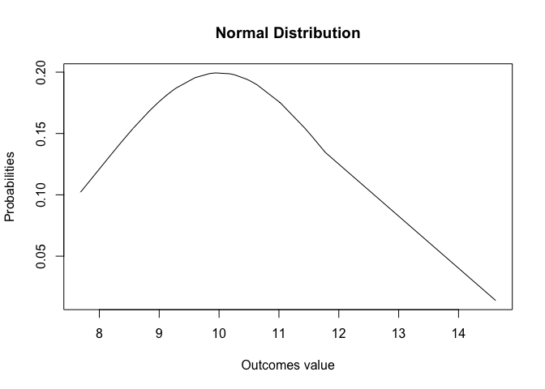
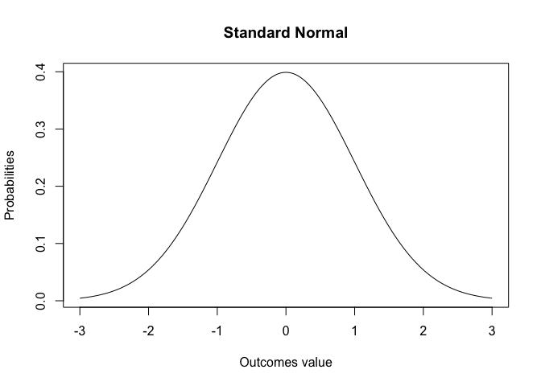
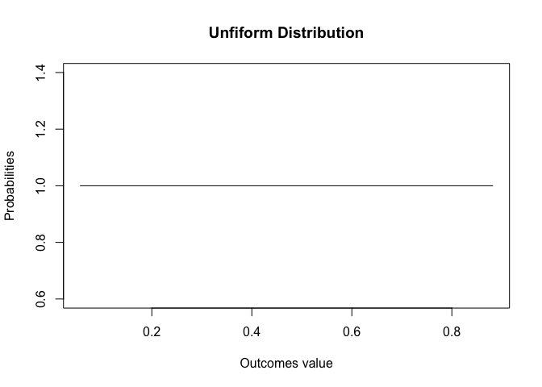
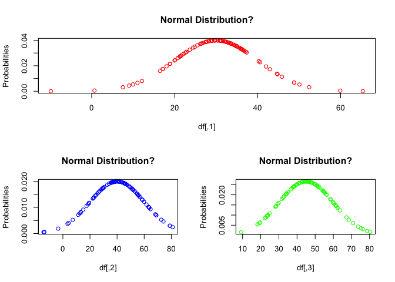

Advanced Data Wrangling
================
Sumad Singh
September 17, 2017

``` r
# STARTING EXAMPLE
# Get a combined score, assign A, B,C,D,E grades at 20%ile, sort by student first names
student <- c("Ja De","Aq Wa","Br Mt","Ds Je","Ja Mc","Cw Cf","Rv Yt","Gj Kl","Jo Ek","JM Rw")
math <- c(502,600,412,358,495,512,410,625,573,522)
science <- c(95,99,80,82,75,85,80,95,89,86)
english <-c(25,22,18,15,20,28,15,30,27,18)
df<- data.frame(student, math, science, english, stringsAsFactors = FALSE)
```

``` r
# COMMON MATHEMATICS FUNCTIONS  
# THESE FUNCTIONS ARE VECTORIZED, I.E THEY WORK ON SCALARS, VECTOTS, DATA FRAMES
# sqrt()
# abs()
# floor()
# ceiling()
# trunc(34.99)
# round(34.993,digits =2 ) digits after decimal
# signif(34.993, digits = 4) significant digits
#cos(), sin(), tan() trig functions
#log(x = ,base = ) , log (x) is natural log
#exp(x)
```

``` r
# STATISTICS FUNCTIONS
# CENTRAL TENDENCY
temp <- c(20,25,11,35,60, 25,11)
sort(temp)
```

    ## [1] 11 11 20 25 25 35 60

``` r
mean(x = temp,trim = 0.05 ,na.rm = TRUE ) # can get trimmed mean after specifying a fraction
```

    ## [1] 26.71429

``` r
 # of observations to be trimmed from each end
median(x = temp,na.rm = TRUE )
```

    ## [1] 25

``` r
# DEVIATION
mad(x = temp) # MEDIAN OF ABSOLUTE DEVIATIONS
```

    ## [1] 14.826

``` r
sd(x = temp,na.rm = TRUE )
```

    ## [1] 16.93826

``` r
var(x = temp)
```

    ## [1] 286.9048

``` r
min(x = temp)
```

    ## [1] 11

``` r
max(x = temp)
```

    ## [1] 60

``` r
range(temp)
```

    ## [1] 11 60

``` r
IQR(temp)
```

    ## [1] 14.5

``` r
# RANK/POSITION
quantile(x = temp,probs = c(0.25,0.5,0.75,1)) # creates approx. quantiles
```

    ##  25%  50%  75% 100% 
    ## 15.5 25.0 30.0 60.0

``` r
# like 25%ile is not 11+ 25%  (20-11) 

# LAGGED SERIES
diff(temp,    # Used to create lagged series, given a vector
     lag = 1 , # order of lag
     differences = 2) # order of difference
```

    ## [1] -19  38   1 -60  21

``` r
# CENTERING AND SCALING : scale() function
# IN GENERAL CENTERING A VARIABLE MEANS SUBTRACTING MEAN VALUES FROM ALL IT' VALUES,
# SCALING MEANS DIVIDING BY STANDARD DEVIATION

scale(x = temp,   # CAN OPERATE ON EACH COLUMN OF A MATRIX LIKE OBJECT
      center = TRUE, # EITHER LOGICAL OR NUMERIC VECTOR WITH VALUES TO USE FOR CENTERING INSTEAD OF MEAN
      scale = TRUE) # EITHER LOGICAL OR NUMERIC VECTOR WITH VALUES TO USE FOR SCALING.
```

    ##            [,1]
    ## [1,] -0.3963975
    ## [2,] -0.1012079
    ## [3,] -0.9277389
    ## [4,]  0.4891714
    ## [5,]  1.9651197
    ## [6,] -0.1012079
    ## [7,] -0.9277389
    ## attr(,"scaled:center")
    ## [1] 26.71429
    ## attr(,"scaled:scale")
    ## [1] 16.93826

``` r
   # IF CENTER IS TRUE, STD. DEVIATION IS USED FOR SCALING, ELSE RMS IS USED

# MOVING A SERIES TO A DESIRED MEAN AND STANDARD DEVIATION
#STEP1: STANDARDIZE THE SERIES
#STEP 2: MULTIPLE SERIES BY DESIRED SD ( THIS DOES NOT CHANGES THE MEAN), 
#THEN ADD THE DESIRED MEAN TO SERIES (THIS DOES NOT CHANGES THE SD)

# PRPOERTY 1 :TO MOVE MEAN OF A SERIES BY K, ADD K TO EACH NUMBER, NOTE THAT THIS DOES NOT CHANGE THE SD
mean(temp)
```

    ## [1] 26.71429

``` r
mean(temp+5)  
```

    ## [1] 31.71429

``` r
sd(temp)
```

    ## [1] 16.93826

``` r
sd(temp+5)  
```

    ## [1] 16.93826

``` r
# PROPERTY 2: TO MAKE THE SD OF A SERIES K TIME, MULTIPLY THE SERIES BY K. MEAN ALSO BECOMES K TIMES 
sd(temp)
```

    ## [1] 16.93826

``` r
 sd(2*temp)
```

    ## [1] 33.87653

``` r
 mean(temp)
```

    ## [1] 26.71429

``` r
 mean(2*temp)
```

    ## [1] 53.42857

``` r
# EXAMPLE OF MOVING SERIES TO A MEAN OF 10 AND SD OF 5 
  
temp.new <- scale(x = temp,center = TRUE, scale = TRUE)
temp.new2 <- temp.new * 5 + 10
mean(temp.new2)  
```

    ## [1] 10

``` r
sd(temp.new2)  
```

    ## [1] 5

``` r
# PROBABILITY FUNCTIONS
# DISCRETE AND CONTINUOUS PROBABILITY DISTRIBUTIONS ARE AVAILABLE in R
# form is - <d/p/q/r><distribution name>, with dpqr meaning and use as below

#d - DENSITY FUNCTION TO GET POINT/ APPROX POINT PROBABILITIES
#r - RANDOM NUMBERS FROM A DISTRIBUTION
set.seed(100)
x <- sort(rnorm(30,10,2)) # RANDOM NUMBERS THAT ARE NORMALLY DISTRIBUTRED 
y <- dnorm(x = x, mean = 10, sd = 2) # APPROXIMATE POINT PROBABILITIES FOR GIVEN X VALUES
plot(x = x,y = y,type = "l", xlab = "Outcomes value",ylab = "Probabilities",main = "Normal Distribution")
```



``` r
#p - CUMULATIVE PROBABILITY FUNCTION
# WHAT IS PROBABILITY for VALUE LESS THAN 2 SD FROM MEAN
pbs <- pnorm(q = c(6,14) ,mean = 10, sd = 2,lower.tail = TRUE)
pbs[2]-pbs[1]
```

    ## [1] 0.9544997

``` r
#q -  WHAT IS THE VALUE OF X FOR WHICH PROB. IS LESS THAN 97.75% OR
# WHAT IS THE VALUE OF X FOR 97.75%ILE VALUE OF A NORMAL DISTRIBUTION
qnorm(p = 0.9775 ,mean = 10 ,sd = 2,lower.tail = TRUE )
```

    ## [1] 14.00931

``` r
# GENERATE A STANDARD NORMAL DENSITY DISTRIBUTION
x <- seq(from = -3, to = 3, by = 0.02)
y <- dnorm(x = x,mean = 0,sd = 1)
plot(x = x,y = y,type = "l", xlab = "Outcomes value",ylab = "Probabilities",main = "Standard Normal")
```



``` r
# PSEUDO RANDOM NUMBER GENERATION
set.seed(100)
ns <- sort(runif(n=20,min = 0, max = 1))
probs <- dunif(x = ns)
plot(x = ns,y = probs,type = "l", xlab = "Outcomes value",ylab = "Probabilities",main = "Unfiform Distribution")
```



``` r
# MULTIVARIATE NORMAL DISTRIBUTION
library(MASS)
set.seed(100)
mean <- c(30,40,45)
cov.mat <- matrix(nrow = 3,ncol = 3, data = c(100,-85, -90,
                                             -85,400,200,
                                              -90,200,225))  
df <- mvrnorm(n = 100 ,mu = mean  ,Sigma = cov.mat)
y1 <- dnorm(x = df[,1], mean = 30, sd = 10)
y2 <- dnorm(x = df[,2], mean = 40, sd = 20)
y3 <- dnorm(x = df[,3], mean = 45, sd = 15)

layout(mat = matrix(nrow = 2,ncol =2 ,data = c(1,1,2,3),byrow = TRUE))
plot(x = df[,1],y = y1,type = "p", xlab = "df[,1]",ylab = "Probabilities",
     main = "Normal Distribution?", col ="red")
plot(x = df[,2],y = y2,type = "p", xlab = "df[,2]",ylab = "Probabilities",
     main = "Normal Distribution?", col = "blue")
plot(x = df[,3],y = y3,type = "p", xlab = "df[,3]",ylab = "Probabilities",
main = "Normal Distribution?" , col = "green")
```



### TABLE OF COMMON PROBABILITY DISTRIBUTIONS

| No  | DISTRIBUTION NAME | FUNCTION |
|-----|-------------------|----------|
| 1   | normal            | norm     |
| 2   | uniform           | unif     |
| 3   | binomial          | binom    |
| 4   | negative binomial | nbinom   |
| 5   | Exponential       | exp      |
| 6   | Poisson           | pois     |
| 7   | Gamma             | gamma    |
| 8   | Weibull           | weibull  |
| 9   | lognormal         | lnorm    |
| 10  | logistic          | logis    |
| 11  | T                 | t        |
| 12  | Chi square        | chisq    |
| 13  | F                 | f        |
| 14  | Geometric         | geom     |
| 15  | Hypergeometric    | hyper    |
| 16  | Cauchy            | cauchy   |
| 17  | Beta              | beta     |

``` r
# CHARACTER MANIPULATION FUNCTIONS
```

``` r
# CONTROL FUNCTIONS
```

``` r
# USER DEFINED FUNCTIONS
```

``` r
# RESHAPE DATA
```
