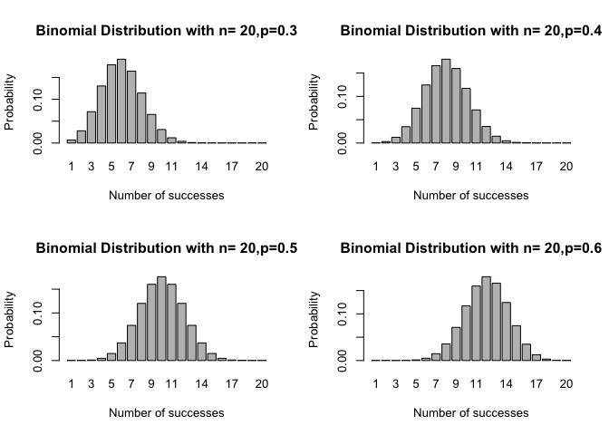
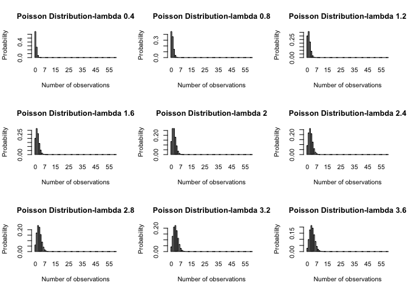
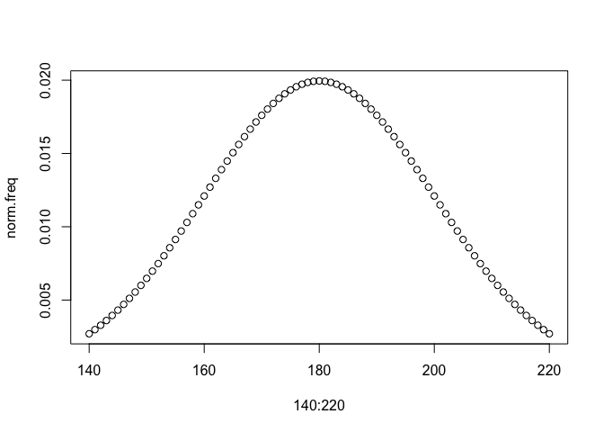
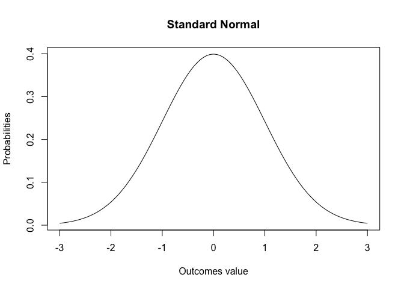
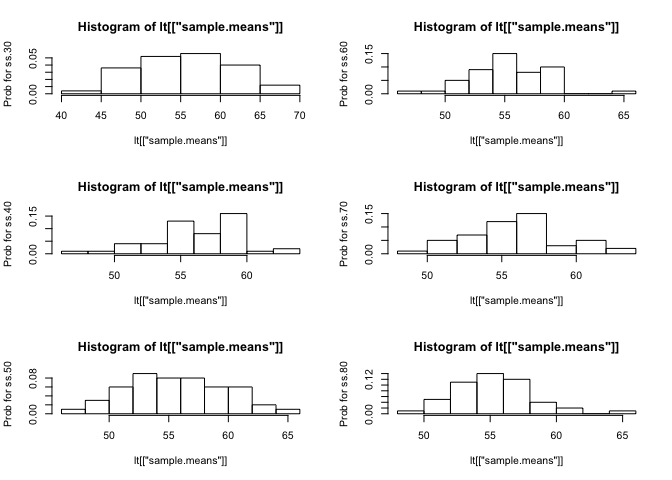
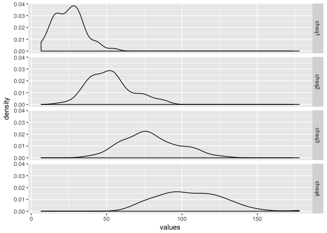
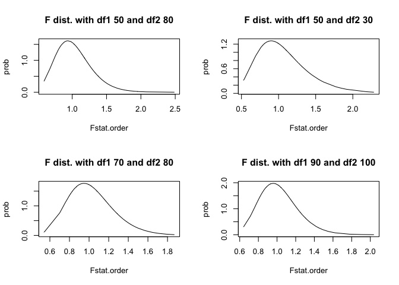

Probability Distributions
================
Sumad Singh
September 19, 2017

``` r
knitr::opts_chunk$set(echo = TRUE)
```

PROBABILITY DISTRIBUTIONS
-------------------------

Graphical represenation linking each values that a random variable can take, to its relative frequency. The random variable could be discrete or continuous. Accordingly, prob. distributions are discrete or continuous.

### DISCRETE DISTRIBUTIONS

For each value of random variable, a relative frequency can be computed and it is the probability of taking that value. Common distributions - \#\#\#\# Binomial Probability distribution from an experiment that has n independent trials,each trial with two fixed outcomes - success & failure, then the random variable, with r successes follows a binomial distribution. eg: customers going in a store, they come out buying or not buying (one might question,the independence though! but, we spare it for later)

##### PDF and parameters of binomial

PDF is mathemtical represenation of Prob. distribution (graphical representation)

$PDF = $ C{\_r <sup>n}p</sup>r (1-p)^{(n-r)}$


Here, for a given n and probability of succes, we can find probabity distribution, by varying r. n and p are the paraemeters of this distribution.

``` r
# SIMULATE A BINOMIAL DISTRIBUTION
btrial.outcomes <- sample(x = c("Buy", "NoBuy"), size = 20, replace = TRUE, prob = c(0.5,0.5))
binomial.prob <- function(trials, successes, p.success)
{
  prob <- (factorial(trials)/(factorial(successes) * factorial(trials - successes))) * 
          ((p.success**successes) * (1-p.success)**(trials-successes))
  return(prob)
}
binomial.prob.dist <- Vectorize(FUN = binomial.prob)

# test 
#binomial.prob(20,5,0.5)
probs1 <- binomial.prob.dist(20,1:20,0.3)
probs2 <- binomial.prob.dist(20,1:20,0.4)
probs3 <- binomial.prob.dist(20,1:20,0.5)
probs4 <- binomial.prob.dist(20,1:20,0.6)
successes <- 1:20
layout(mat = matrix(data = c(1,2,3,4),nrow = 2,byrow = TRUE))
barplot(height = probs1, names.arg = successes,main = "Binomial Distribution with n= 20,p=0.3",
        xlab = "Number of successes", ylab = "Probability")
barplot(height = probs2, names.arg = successes,main = "Binomial Distribution with n= 20,p=0.4",
        xlab = "Number of successes", ylab = "Probability")
barplot(height = probs3, names.arg = successes,main = "Binomial Distribution with n= 20,p=0.5",
        xlab = "Number of successes", ylab = "Probability")
barplot(height = probs4, names.arg = successes,main = "Binomial Distribution with n= 20,p=0.6",
        xlab = "Number of successes", ylab = "Probability")
```



##### OBSERVATION

For probabilities less than 0.5, distribution is right skewed, for &gt; 0.5 it becomes left skewed. When prob. of success is lower, it becomes increasingly less probable to get an increase in no. of successes, when p is higher, it becomes less probable to get low number of successes.

#### Poisson

Typical for random experiments related to observing counts in an interval of time, given one knows the average count per unit time. ASSUMPTION : PROBABILITY DISTRIBUTION REMAINS SAME FOR A GIVEN TIME INTERVAL, AND IS NOT DEPENDENT ON POINT OF START OF THE INTERVAL Example: Number of cars arriving at a toll booth in 5 mins is likely a poisson random variable

##### PDF and parameters

P(x) = $ $


i.e probability of observing x counts in TIME T, for which avg. rate of observations is known (i.e lambda OVER TIME T is known) lambda is the parameter of the distribution

``` r
# SIMULATE PROB. DISTRIBUTION
set.seed(111)
# Define a function to compute poisson probability
pois.prob <-  function( lambda, number.obs)
{
  prob <- (exp(-lambda) * (lambda^number.obs)) / factorial(number.obs)
  return(prob)
}

# Vectorize it to operate on a range of no. of observations
pois.dist <- Vectorize(FUN = pois.prob)

lambda <- seq(0.4,3.6,0.4)
obs <- 0:60

# Use apply family to further vectorize it on a range of parameter lambda
pois.probs <- sapply(X = lambda,FUN = pois.dist,number.obs = obs)
colnames(pois.probs) <- paste("lambda", seq(0.4,3.6,0.4), sep="_" )


layout(mat = matrix(data = c(1:9),nrow = 3,byrow = TRUE))
barplot(height = pois.probs[,"lambda_0.4"], names.arg = 0:60, main = "Poisson Distribution-lambda 0.4",
        xlab = "Number of observations", ylab = "Probability",space = 0.3)
barplot(height = pois.probs[,"lambda_0.8"], names.arg = 0:60, main = "Poisson Distribution-lambda 0.8",
        xlab = "Number of observations", ylab = "Probability",space = 0.3)
barplot(height = pois.probs[,"lambda_1.2"], names.arg = 0:60, main = "Poisson Distribution-lambda 1.2",
        xlab = "Number of observations", ylab = "Probability",space = 0.3)
barplot(height = pois.probs[,"lambda_1.6"], names.arg = 0:60, main = "Poisson Distribution-lambda 1.6",
        xlab = "Number of observations", ylab = "Probability",space = 0.3)
barplot(height = pois.probs[,"lambda_2"], names.arg = 0:60, main = "Poisson Distribution-lambda 2",
        xlab = "Number of observations", ylab = "Probability", space = 0.3)
barplot(height = pois.probs[,"lambda_2.4"], names.arg = 0:60, main = "Poisson Distribution-lambda 2.4",
        xlab = "Number of observations", ylab = "Probability", space = 0.3)
barplot(height = pois.probs[,"lambda_2.8"], names.arg = 0:60, main = "Poisson Distribution-lambda 2.8",
        xlab = "Number of observations", ylab = "Probability", space = 0.3)
barplot(height = pois.probs[,"lambda_3.2"], names.arg = 0:60, main = "Poisson Distribution-lambda 3.2",
        xlab = "Number of observations", ylab = "Probability",space = 0.3)
barplot(height = pois.probs[,"lambda_3.6"], names.arg = 0:60, main = "Poisson Distribution-lambda 3.6",
        xlab = "Number of observations", ylab = "Probability",space = 0.3)
```



##### OBSERVATION

Right skewed distribution, as lambda increases, the right skew starts decreasing. i.e the probability of a higher count observation starts increasing, and that of lower count starts decreasing.

### CONTINUOUS DISTRIBUTIONS

Probability is defined for a range of values of the random variable, and not at a specific point. Since, a continuous random variables is expected to take an infite set of distinct values, the probability of taking a single value is effectively 0. Area under the curve of a probability distribution b/w two points, is the probability that random variable can take a value b/w those points.

Common continuous distributions -

#### Normal Distribution

Normal distribution's relative frequency is maximum at the mean and tapers off as we move away from the mean

##### PDF and Parameters of Normal Distribution

$ PDF = f(x) = e<sup>{{}}</sup>2$


It is a two parameter distribution, with location i.e mean and scale i.e std. deviation parameters. Its shape paramter or skewness is 0. The kurtosis or peakedness is 3, and peakedness of normal distribution is taken as reference.

Example : What do you get using the PDF function for a discrete value of x Ans : The relative frequency at that point, not the probability

``` r
norm.freq <- dnorm(x = 140 :220,mean = 180,sd = 20 )
plot(x = 140:220, y = norm.freq,type = "p")
```



##### Properties of Normal Distribution

1.  The area covered between two points at known standard deviations away from mean remains the same for every normal distribution
2.  More area is covered closer to the mean, and as you go away from mean, it reduces Example: Area covered in 1 sd = 68% , 2sd = 95.5%, 3sd = 99.7% . For every 2 sd movement away from mean, probability increment is 27.5%age points and 2.2%age points.
3.  probability is defined between two points and not at a point P (a&lt;= x &lt;=b) = ∫ ƒ(x) dx from a to b

``` r
x <- seq(from = -3, to = 3, by = 0.02)
y <- dnorm(x = x,mean = 0,sd = 1)
plot(x = x,y = y,type = "l", xlab = "Outcomes value",ylab = "Probabilities",main = "Standard Normal")
```



1.  Method of finding probability of a random variable with normal distribution

-   use integral method
-   another property is that the probability could be computed by converting it to a standard normal using z transformation.

#### CENTRAL LIMIT THEOREM

If we draw large sized independent samples of equal size from a population, which could be anyway distributed, the distribution of mean of the samples tends to be normal, and Same SD = Pop. SD / √n Sample Mean = Population Mean n &gt;=30 qualifies for large sample.

``` r
# Draw random numbers from a uniform distribution, compute mean and sd

# Draw samples of size n, compute mean and sd of each sample

# Compute Mean and SD of the distribution of means

# Verify relationship of mean and SD, and if distributions is normal

samples.df <- Vectorize(FUN = sample, vectorize.args = "size")

clt <- function(pop, sample.size, no.of.samples)
{
  # computes pop mean
  # draws give no. of random samples of given size from the population
  # computes mean and sd of sample means
  # Compares mean of sample means and their sd, from population per relationship
  # Returns a vector of pop mean na sd, sampling distribution's mean and sd, sample size
  # returns a vector of the sample means
  pop.mean <- mean(pop)
  pop.sd <- sqrt(sum((pop-mean(pop))^2)/length(pop))
  # Call a vectorized function to draw independent same sized samples
  df <- samples.df(x =pop, size = rep(sample.size, no.of.samples), replace = TRUE)
  sample.means <- apply(X = df,MARGIN = 2,FUN = mean)
  sample.sds <- apply(X = df,MARGIN = 2,FUN = sd)
   
  mean.sample.means <- mean(sample.means)
  sd.sample.means <- sd(sample.means) # uses n-1 is denominator
  derived.sd.sample.means <- pop.sd / ((sample.size)^0.5) # using n in denominator
  name <- paste("ss",sample.size,sep=".")
  stats <- c(pop.mean, pop.sd, mean.sample.means, sd.sample.means, derived.sd.sample.means) 
  lst <- list(name = name, stats = stats, sample.means = sample.means, samples = df)
  return(lst)
}

clt.vec <- function(pop, sample.size.vec, sample.no){
# Vectorize clt.vec
lt <- list()
length(lt) <- length(sample.size.vec)
#master.lt <- rep(lt, length(sample.size.vec))
names(lt) <- paste("ss", sample.size.vec, sep=".")

for (ss in sample.size.vec){

  name.list <- paste("ss", ss, sep=".")
  lt[[name.list]] <- clt(pop, ss, sample.no)
}
return(lt)
}

plot.dist <- function(lt){
  # function to extract
p <- hist(x = lt[["sample.means"]],freq = FALSE, ylab = paste("Prob for", lt[["name"]]))
return(p)
  }

set.seed(101)
pop <- runif(n = 500,min = 10,max = 100)
sample.size <- seq(30,80,10)
no.of.samples <- 50
result <- clt.vec(pop,sample.size,no.of.samples)

# Show the means and sd match
df <- sapply(X = result, function(lt2) {lt2[["stats"]]})
names <- c("pop.mean", "pop.sd", "mean.sample.means", "sd.sample.means","derived.sd.sample.means") 
df <- cbind(names,df)
df
```

    ##      names                     ss.30              ss.40             
    ## [1,] "pop.mean"                "55.5574205192784" "55.5574205192784"
    ## [2,] "pop.sd"                  "25.9783032261275" "25.9783032261275"
    ## [3,] "mean.sample.means"       "55.9907184352307" "56.257663433986" 
    ## [4,] "sd.sample.means"         "5.81739249180638" "3.32492967406885"
    ## [5,] "derived.sd.sample.means" "4.74296756088642" "4.10753039705315"
    ##      ss.50              ss.60              ss.70             
    ## [1,] "55.5574205192784" "55.5574205192784" "55.5574205192784"
    ## [2,] "25.9783032261275" "25.9783032261275" "25.9783032261275"
    ## [3,] "55.7968203733796" "55.3588340065675" "55.894535516577" 
    ## [4,] "4.15912216575131" "2.94770962162337" "3.17581578645008"
    ## [5,] "3.67388687498302" "3.3537845252506"  "3.10500112378315"
    ##      ss.80             
    ## [1,] "55.5574205192784"
    ## [2,] "25.9783032261275"
    ## [3,] "55.3342051919119"
    ## [4,] "2.80767560345233"
    ## [5,] "2.90446259768616"

``` r
# Show the prob. distr. approaches normal as n increases.
layout(mat = matrix(data = c(1,2,3,4,5,6),nrow = 3))
sapply(X = result,FUN = plot.dist)
```



    ##          ss.30                  ss.40                 
    ## breaks   Integer,7              Integer,10            
    ## counts   Integer,6              Integer,9             
    ## density  Numeric,6              Numeric,9             
    ## mids     Numeric,6              Numeric,9             
    ## xname    "lt[["sample.means"]]" "lt[["sample.means"]]"
    ## equidist TRUE                   TRUE                  
    ##          ss.50                  ss.60                 
    ## breaks   Integer,11             Integer,11            
    ## counts   Integer,10             Integer,10            
    ## density  Numeric,10             Numeric,10            
    ## mids     Numeric,10             Numeric,10            
    ## xname    "lt[["sample.means"]]" "lt[["sample.means"]]"
    ## equidist TRUE                   TRUE                  
    ##          ss.70                  ss.80                 
    ## breaks   Integer,9              Integer,10            
    ## counts   Integer,8              Integer,9             
    ## density  Numeric,8              Numeric,9             
    ## mids     Numeric,8              Numeric,9             
    ## xname    "lt[["sample.means"]]" "lt[["sample.means"]]"
    ## equidist TRUE                   TRUE

``` r
#rm(list = ls())
```

CLT allows one to make inferences about population charatertistics of location and scale from a sample.

#### T DISTRIBUTION

When the sample size is small or the population standard deviation is not known, and sample sd is taken as proxy of population sd, then the sampling distribution of means is taken as t - distribution.

Formally, defined as If Z1 is a standardized nornal variables and Z2 is a chi square variable with df k, then t = Z1 / sqrt(Z2/k)

##### PDF and parameters

PDF ? Degrees of Freedom: In general, how many values in a set can be varied, given a set of constraints on the set of values. For a data set of size n, the degress of freedom are n-1, if mean is fixed. Because mean is known, only n-1 values can be varied, and hence the degree of freedom.

Degrees of freedom is the only parameter of t-distribution.

##### PROPERTIES OF T DISTRIBUTIONS

1.Mean is 0. 2.It is flatter in the tails than the standard normal distribution, it's variance is more than 1 and is df/df-2 3.It is used for random variables, with more uncertainity at extreme values, as it is fatter in the tails, than normal distribution.

``` r
p1 <- pnorm(q = -2, mean = 0,sd = 1,lower.tail = TRUE )
p2 <- pt(q = -2,df = 1:100 ,lower.tail = TRUE )
p2-p1 # add'l probability is captured by std. t -distribution in the left tail, for a range of df
```

    ##   [1] 0.124833486 0.069001578 0.046912852 0.035308130 0.028219607
    ##   [6] 0.023463024 0.020059532 0.017507987 0.015526280 0.013943885
    ##  [11] 0.012651846 0.011577375 0.010670047 0.009893844 0.009222372
    ##  [16] 0.008635850 0.008119171 0.007660601 0.007250886 0.006882636
    ##  [21] 0.006549874 0.006247719 0.005972143 0.005719793 0.005487858
    ##  [26] 0.005273962 0.005076082 0.004892487 0.004721687 0.004562391
    ##  [31] 0.004413476 0.004273961 0.004142984 0.004019786 0.003903694
    ##  [36] 0.003794112 0.003690507 0.003592404 0.003499376 0.003411040
    ##  [41] 0.003327049 0.003247092 0.003170885 0.003098170 0.003028712
    ##  [46] 0.002962298 0.002898732 0.002837835 0.002779442 0.002723402
    ##  [51] 0.002669576 0.002617835 0.002568061 0.002520143 0.002473979
    ##  [56] 0.002429475 0.002386544 0.002345102 0.002305075 0.002266390
    ##  [61] 0.002228982 0.002192788 0.002157750 0.002123814 0.002090928
    ##  [66] 0.002059045 0.002028119 0.001998108 0.001968972 0.001940673
    ##  [71] 0.001913176 0.001886447 0.001860454 0.001835168 0.001810559
    ##  [76] 0.001786602 0.001763270 0.001740540 0.001718387 0.001696792
    ##  [81] 0.001675732 0.001655189 0.001635143 0.001615577 0.001596473
    ##  [86] 0.001577816 0.001559590 0.001541780 0.001524371 0.001507352
    ##  [91] 0.001490708 0.001474428 0.001458500 0.001442912 0.001427653
    ##  [96] 0.001412714 0.001398084 0.001383754 0.001369715 0.001355957

``` r
# compared to standard normal
```

1.  As degrees of freedom increase, variance approaches 1, it tends to normal

``` r
# Plot a t and standard normal
```

#### Chi-Square

If k independent normal random variable are squared and added, the resulting variable forms a distribution called chi-square distribution with degrees of freedom k.

Example : See below

##### PDF and parameters

Degrees of freedom is the parameter

##### PROPERTIES OF chisquare DISTRIBUTION

-   lies b/w 0 and inf
-   right skewed distribution, skew decreases as df increases (see example below) and becomes more symetric

``` r
rnorm1 <- rnorm(n = 100,mean = 5,sd = 1)
sq.rnorm1 <- rnorm1^2
rnorm2 <- rnorm(n = 100,mean = 5,sd = 1)
sq.rnorm2 <- rnorm2^2
rnorm3 <- rnorm(n = 100,mean = 5,sd = 1)
sq.rnorm3 <- rnorm3^2
rnorm4 <- rnorm(n = 100,mean = 5,sd = 1)
sq.rnorm4 <- rnorm4^2

chsq1 <- sq.rnorm1
var1 <- rep("chsq1", length(chsq1))
chsq2 <-  sq.rnorm1 + sq.rnorm2
var2 <- rep("chsq2", length(chsq2))
chsq3 <- sq.rnorm1 + sq.rnorm2 + sq.rnorm3
var3 <- rep("chsq3", length(chsq3))
chsq4 <- sq.rnorm1 + sq.rnorm2 + sq.rnorm3 + sq.rnorm4
var4 <- rep("chsq4", length(chsq4))
df <- data.frame(name = c(var1,var2,var3,var4), values = c(chsq1, chsq2, chsq3, chsq4))

#install.packages("ggplot2")
library(ggplot2)
ggplot(data = df,mapping = aes(x= values)) + geom_density() + facet_grid(facets = name ~.) 
```



#### F or Fisher's

F distribution is the probability distribution of F statistic.

F STATISTIC F statistic is used to compare the variance of two normal random variables, after drawing samples independently from them. Say, for two normal distributed random variables with population std. deviations as *σ*<sub>1</sub>, *σ*<sub>2</sub> , sample sizes *n*<sub>1</sub> and *n*<sub>2</sub> are drawn with standard deviaitons *s*<sub>1</sub>, *s*<sub>2</sub> .

$F = $\\frac{{}(\\frac{s\_1}{\\sigma\_1})^2} {(\\frac{s\_2} {\\sigma\_2})^2}$


F distribution is also defined as the ratio of two independent chi-square random variables that are with df k1 and k2 F = (Z1/k1) / (Z2/k2)

##### PDF and Parameters

?PDF The distribution of F-statistic forms F distribution The degrees of freedom of the two normal distributions df1 and df2 are parameters of F distributions

``` r
# Generate populations of two normal random variables
norm1 <- rnorm(n = 500,mean = 5,sd = 1)
norm2 <- rnorm(n = 500,mean = 7,sd = 2)
sample.size1 <- 50
sample.size2 <- 80
repeat.draws1 <- 100
# VECTORIZE SAMPLE FUNCTION TO TAKE MULTIPLE DRAWS
sample.multiple <- Vectorize(FUN = sample,vectorize.args = "size")
samples.norm1 <- sample.multiple(x = norm1, size = rep(sample.size1, repeat.draws1) ,replace = TRUE)
samples.norm1.sd <- apply(X = samples.norm1,MARGIN = 2,FUN = sd)

samples.norm2 <- sample.multiple(x = norm2, size = rep(sample.size2, repeat.draws1) ,replace = TRUE)
samples.norm2.sd <- apply(X = samples.norm2,MARGIN = 2,FUN = sd)

Fstat <- ((samples.norm1.sd / 1)^2 ) / (samples.norm2.sd / 2)^2
Fstat.order <- sort(Fstat)  
prob <- df(x = Fstat.order ,df1 = 50,df2 = 80 )
# PLOTS
layout(mat = matrix(c(1,2,3,4),nrow = 2))

p1 <- plot(x = Fstat.order, y = prob,type = "l",main = "F dist. with df1 50 and df2 80")

# PLOT 2
sample.size1 <- 70
sample.size2 <- 80
repeat.draws1 <- 100

samples.norm1 <- sample.multiple(x = norm1, size = rep(sample.size1, repeat.draws1) ,replace = TRUE)
samples.norm1.sd <- apply(X = samples.norm1,MARGIN = 2,FUN = sd)
samples.norm2 <- sample.multiple(x = norm2, size = rep(sample.size2, repeat.draws1) ,replace = TRUE)
samples.norm2.sd <- apply(X = samples.norm2,MARGIN = 2,FUN = sd)

Fstat <- ((samples.norm1.sd / 1)^2 ) / (samples.norm2.sd / 2)^2
Fstat.order <- sort(Fstat)  
prob <- df(x = Fstat.order ,df1 = 70,df2 = 80 )
p2 <- plot(x = Fstat.order, y = prob,type = "l",main = "F dist. with df1 70 and df2 80")

# PLOT 3
sample.size1 <- 50
sample.size2 <- 30
repeat.draws1 <- 100

samples.norm1 <- sample.multiple(x = norm1, size = rep(sample.size1, repeat.draws1) ,replace = TRUE)
samples.norm1.sd <- apply(X = samples.norm1,MARGIN = 2,FUN = sd)
samples.norm2 <- sample.multiple(x = norm2, size = rep(sample.size2, repeat.draws1) ,replace = TRUE)
samples.norm2.sd <- apply(X = samples.norm2,MARGIN = 2,FUN = sd)

Fstat <- ((samples.norm1.sd / 1)^2 ) / (samples.norm2.sd / 2)^2
Fstat.order <- sort(Fstat)  
prob <- df(x = Fstat.order ,df1 = 50,df2 = 30 )
p3 <- plot(x = Fstat.order, y = prob,type = "l",main = "F dist. with df1 50 and df2 30")


# PLOT 4
sample.size1 <- 90
sample.size2 <- 100
repeat.draws1 <- 100

samples.norm1 <- sample.multiple(x = norm1, size = rep(sample.size1, repeat.draws1) ,replace = TRUE)
samples.norm1.sd <- apply(X = samples.norm1,MARGIN = 2,FUN = sd)
samples.norm2 <- sample.multiple(x = norm2, size = rep(sample.size2, repeat.draws1) ,replace = TRUE)
samples.norm2.sd <- apply(X = samples.norm2,MARGIN = 2,FUN = sd)

Fstat <- ((samples.norm1.sd / 1)^2 ) / (samples.norm2.sd / 2)^2
Fstat.order <- sort(Fstat)  
prob <- df(x = Fstat.order ,df1 = 90,df2 = 100 )
p4 <- plot(x = Fstat.order, y = prob,type = "l",main = "F dist. with df1 90 and df2 100")
```



###### OBSERVATION

The location and peakedness vary by df1 and df2, these plots need to be put on same x and y scales for later ?

##### Properties of F distributions

-   skewed to the right
-   ranges from 0 to inf
-   depends on df of numerator and denominator

#### Exponential

#### Gamma

#### Weibull

#### Tweedie

#### Lognormal
