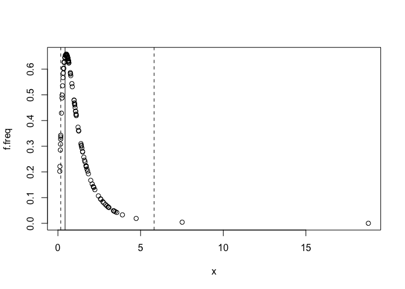
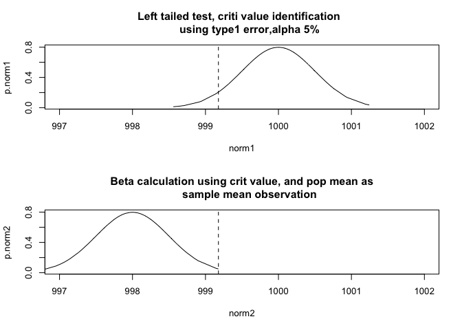
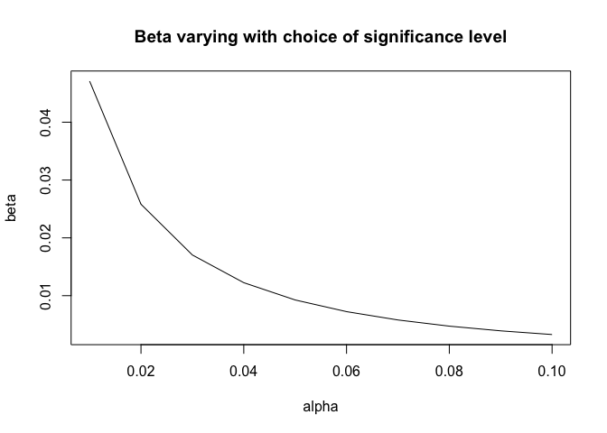
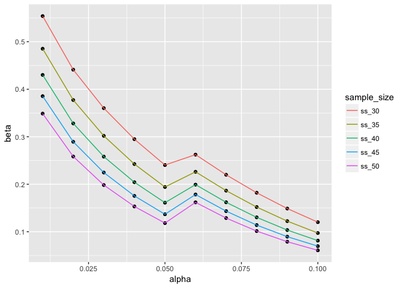

Hypothesis Testing
================
Sumad Singh
September 25, 2017

``` r
knitr::opts_chunk$set(echo = TRUE)
```

HYPOTHESIS TESTING
------------------

TYPES OF HYPOTHESIS TESTS WHEN COMPARING POPULATIONS (TBDe)
-----------------------------------------------------------

1. COMPARE MEASURES OF CONTINUOUS DATA LIKE MEANS,PROPORTIONS,VARIANCES - Z,T,F      
2. COMPARE MEASURES OF CATEGORICAL DATA LIKE COUNTS - CHISQUARE (TBDe) UNDER CONDITIONS OF POPULATION PARAMETER KNOWN/UNKNOWN, SAMPLE SIZE LARGE/SMALL UNDERLYING DISTRIBUTIONS KNOWN/UNKNOWN  
3. P VALUE, DECISION ERRORS, POWER OF A TEST  
4. ANNOVA - ONE WAY, TWO WAY (TBD)  
5. NON PARAMETRIC TESTS USED FOR CONTINUOUS MEASURES WHEN ASSUMPTIONS ARE VIOLATED (TBD)  
- MANN WHITNEU U TEST 
- WILCOXON T TEST  
- KRUSHAL WALIS H TEST

NOTE : TBDE MEANS TO BE DETAILED ,TBD TO BE DONE

### HYPOTHESIS TESTING

Problem Solving in Business context requires testing beleifs, prevelant opinions about a population of interest to introduce interventions. Example: - Whitelight bulbs over the shelves can imrpove sales than daylight bulbs.
- Customers would not defect if given an increase in premium equal or less than inflation rate
The case for interventions is made by hypothesis testing, it involves-
1. Defining the business problem
2. Laying out Hypothesis tests
3. Identifying data (sample) to be gathered for testing hypothesis,
sampling considerations ( random, stratified etc), size etc
4. Identifying test statistic, confidence interval/significance level/ testing error considerations
5. Testing,Derive inferences and make recommendations

#### 1. HYPOTHESIS STATEMENT

A positive assertion about a **population characteristic** based on a currently held beleif.
- Null Hypothesis: captures it mathematically by using relevant metrics. Null Hypothesis is stated
using an **inequality (&lt;= or &gt;=)**.
- Alternate hypothsis: states a counter beleif mathematically.

**Any problem statement, or a change to an existing norm/well accepted idea that needs to be proved is put as 'Alternate Hypothesis'. Unless proven, null hypothesis is the accepted idea.**

Examples: PROBLEM STATEMENT-
A a new driver is more likely to suffer a loss in first 6 months/first policy period
than subsequent policy periods, so 'no. of times renewed' could be a predictor for
ultimate loss

Null Hypothesis: Mean loss of new drivers in 1st policy period &gt;= Mean loss in 2nd Alternate Hypothesis: Mean loss of new drivers in 1st policy period &lt; Mean loss in 2nd

#### 2. STATISTICALLY TESTING HYPOTHESIS (jumping to step 4)

The idea is to reject null hypothesis by proving that the difference observed in the population parameter and sample parameter is not just a matter of chance and but a systematic difference. This is often cited as
testing if the difference is **statistically significant**

**CHOICE OF SAMPLING DISTRIBUTION OR TEST STATISTIC AND**  
**SIGNIFICANCE LEVEL/CONFIDENCE FOR THE TEST AND**  
**CRITICAL VALUES AND REGION DETERMINATION**  
1. We use CLT , sample size and test metric to determine the choice of sampling distribution and hence test statistic  
2. We also choose a confidence level / significance level, using which null hypothesis can be  
confidently rejected. *Signficance level* is a probability that null hypothesis is true and yet  
as a matter of chance, we reject it based on sample observation. It represents what is called Type 1 error (more on this later).We choose to minimize the probability of making Type1 error due to chance.  
The choice of confidence level/significance level varies with the 'research problem'.  
3. Based on the hypothesis and confidence level, we choose the critical value, i.e the value used to make the decision of   accepting/rejecting null hypothesis such that even if we make the Type 1 error,it is tolerable.  
And then we compare the sample observation to this 'Critical Value' to determine the decision of rejecting or not being    
able to reject Null Hypothesis.  
Critical region : left tail,right tail, two tailed, formed by the critical value and tail/tails,
determined by sign of inequality of alternate hypothesis.

Example with test metric = mean, sample size &gt;30.
Average waiting time in retail stores for customer is 2.6 mins.Based on a sample of 50 obs.,
it was found to be 2.9 mins with std. deviation of 0.5 mins in store X.
Do the customers in store X wait longer than that the retail store average.

H0 : mu &lt;= 2.6
H1 : mu &gt; 2.6

1.  Sampling distribution of sample mean is 'normal' per CLT for large sample sizes ,so the test
    statistic should be 'z',and mean of sampling distribution of means = population mean, std. error = sigma/sqrt(n).
    But population std. deviation is not known, so we take distribution as t.But let us try
    with normal first.  
    So, we have a nomal distriution with mean as population mean, and the observed sample mean
    can be pictured on this distribution a certain distance away from population mean.
2.  The test is whether this distance is significant, and signifiance brings into picture an
    assumption of **significance/confidence** we are comfortable with. If we take it as 5%,
    it means in 5/100 samples, we could get an observation that could lead us to reject a true
    null hypothesis.  
3.  Using the probability of significance, we find the critical value pertaining to 5%.
    First we see it is a right tailed test seeing the alternate hypothesis.
    (Sign of alternate hypothesis determines the critical region, if the hypothesis
    are stated correctly as defined above.)

``` r
# Convert the sampling distribution with mean 2.6 an sd 0.5 to standard normal
# Then convert sample observation to z stat. on this same scale
# i.e 
z = (2.9-2.6)/(0.5/sqrt(50))
z.crit = qnorm(p = 0.95,mean = 0,sd = 1,lower.tail = TRUE)
```

This is a right tailed test, critical region lies right to the critical value.
z statistic lies lies in the critical region,i.e beyond the critical value,
so we can reject the null hypothesis.

``` r
# To picture ths values
r.norm <- sort(rnorm(n = 50))
f.norm <- dnorm(x = r.norm, mean = 0,sd = 1 )
plot(x = r.norm,y = f.norm,xlim = c(-4,4))
abline(v = c(z.crit,z), lty = c(2,1))
text(x = c(z.crit,z),y = c(0.005,0.005),labels = c("z.crit","z"))
```

  

The test statistic used should have been t.  

``` r
# Convert the sampling distribution with mean 2.6 and sd 0.5 to t distribution
# Then convert sample observation to t stat. on this same scale
# i.e 
t = (2.9-2.6)/(0.5/sqrt(50))
t.crit = qt(p = 0.95,df = 49,lower.tail = TRUE) # df 49 as s was used
# To picture ths values
r.t <- sort(rt(n = 50,df = 49))
freq.t <- dt(x = r.t, df = 49 )
plot(x = r.t,y = freq.t,xlim = c(-4,4))
abline(v = c(t.crit,t), lty = c(2,1))
text(x = c(t.crit,t),y = c(0.05,0.05),labels = c("t.crit","t"))
```

  

### TYPES OF HYPOTHESIS TESTS AND TEST STATISTICS USED

### CONTINUOUS MEASURES (TBD?)

1.  COMPARE SAMPLE MEAN TO A POPULATION MEAN  
1.1 SAMPLE SIZE &gt;30 & POP. STD. DEVIATION KNOWN : Z STAT.  
1.2 LESS THAN 30 OR POP. STD. DEVIATION NOT KNOWN : T STAT.  

2.  COMPARE SAMPLE PROPORTION TO A POPULATION PROPORTION

3.  COMPARE TWO POPULATION MEANS
    PAIRED OBSERVATION (Z TEST ) VS SEPARATE SAMPLE TEST (INDEPENDENT T TEST), FIRST IS BETTER
    EXPEERIMENT DESIGN  
    3.1 SAMPLE SIZE &gt;30 AND POP. MEANS ARE KNOWN : Z TEST   
    3.2 LESS THAN 30 OR POP MEAN UNKNOWN : INDEPENDENT T TEST  

In both the cases, the sampling distribution of difference of means is considered, the standard error of
sampling distribution is essentially sqrt. of sum of variances of sampling distribution of means of
individual populations.  
sqrt(sigma1^2/n1 + sigma1^2/n2) .
The degree of freedom calculation varies on whether population std. deviation is known or not. MORE ELABORATION NEEDED UNDER A SEPARATE PROJECT  

EXAMPLES:  A problem of interest could be to compare the sweetness on a scale for two cold drinks.If we use the
same set of sample, it is a paired observation test, depending on if the population std. deviations
are known, and sample sizes chosen, we make choise of sampling distribution and hence test stat.
It is presumed that customer shopping for policies online gives a better overall shopping experience with information submission time less than 5 mins, than those who take more than 5 mins.  
So, submission time is an important metric for customer satisfaction score taken on a scale of 1:10.  

    Sample of 15 customers each are taken from the two groups, one that took <5 mins and other that took 
    >5 mins, and scores are taken on scale of 1:10  
      
    |Group|N|Mean Score|SD|  
    |---|---|---|---|
    |<5mins|15|9.3|1.5|  
    |>5mins|15|7.9|1.9|  

    Hypothesis:  
    H0 : µ1 - µ2 = 0
    H1 : µ1 - µ2 > 0 

    Sampling Distribution/Test Statistic/Significance Level:  
    * The sampling distribution of difference of sample means will follow CLT. Here we don't know the  
      population sigmas, sample sizes are small as well.We don't know if the the underlying populations are normal, 
      to accomodate for small samples, and if their varinces are  equal or not.  
    * A simplifying assumption we take is that scores are normally distributed in two underlying populations,
      that compensates for small samples, now can say sampling distribution will be approx. t.
    * standard error and degrees of freedom of sampling distribution can be computed in two ways depending  
      on whether the variance of underlying population is same or different. If they are different, the  
      distribution can be approximated as t, but a possible better way is to use non-parametric methods.  
      If the variances are equal ( this can tested using F-test), then -

``` r
# pooled sd of two samples
 sd.pop.pooled <- sqrt((1.5^2 * (15-1) + 1.9^2 * (15-1)) / (15-1 + 15 -1 ))
# used to find std. error
 std.error <- sqrt(sd.pop.pooled ^2 / 15 +  sd.pop.pooled ^2 / 15)
 df <- (15 - 1) + (15 - 1)
 # Take significance level as 5%
 # Under null hypothesis, the difference of samples means is ditributed with t, with mean as 0
 # and std. deviation as std.error
 # The t statistic of observed sample differences
 t <- (9.3 - 7.9) / std.error
 t.crit <-  qt(p = 0.95,df = df,lower.tail = TRUE)  
 print(c(t,t.crit))
```

    ## [1] 2.239881 1.701131

DECISION : Reject Null Hypothesis

1.  COMPLARE TWO POPULATION PROPORTIONS

2.  COMPARE VARIANCES OF TWO POPULATIONS : F TEST

We can draw different size samples from two populations assumed to be normally distributed. A sample drawn from a **normally distributed** population fulfills the property that  
(n-1)s<sup>2/sigma</sup>2 ≈ X2, is a chisquare random variable with (n-1) df  

For two populations, assumed to be normally distributed, if the population variance is same, then the ratio
of sample variance follows an F distribution as,  

s1^2 / s2^2 = (X1^2 . sigma1^2) / (n1-1) $\\frac{s\_1^2}{s\_2^2} = \\frac{\\frac{\\chi\_1^2 . \\sigma\_1^2}{n\_1-1}}{\\frac{\\chi\_2^2 . \\sigma\_2^2}{n\_2-1}}$  
  
and can be seen to become the F statistic  
  

Null Hypothesis is always, that population variances are equal and thus we say, the ratios of square sample
sds follow an F distribution with given dfs. Based on hypothesis formulation, we look to do a left, right or two tailed test with a chosen significance
level, understanding the under null hypothesis that F statistic is 1, we are looking if the distance calculated
from sample F statistic is significant from 1.

Example: Comparing the footfalls in two stores of a company to check that variance in footfall is different.
H0 : sigma1 = sigma2 H1 : sigma1 \# sigma2

``` r
# For 7 days footfalls are recorded
s1 <- c(214,185,214,186,182,220,220)
s2 <-  c(171,185,236,175,227,198,172)
sd.s1<- sd(s1)
sd.s2 <-  sd(s2)
df1 <- 6
df2 <- 6
# Under null hypothesis, Sampling distribution or test statistic is F, df1 = df2 =6
# Two tailed test, critical points can be computes using signficance level of 5%
f.stat <- (sd.s1/sd.s2)^2
f.citical.right <- qf(p = 0.975,df1 = df1,df2 = df2)
f.citical.left <- qf(p = 0.025,df1 = df1,df2 = df2)

# For visualization
x <- sort(rf(n = 100,df1 = df1,df2 = df2))
f.freq <- df(x = x,df1 = df1, df2 =df2)
plot(x = x,y = f.freq,type = "p")
abline(v = c(f.citical.left,f.citical.right,f.stat),lty = c(2,2,1))
```



Decision : Cannot Reject Null Hypotheis

### CATEGORICAL MEASURES LIKE COUNTS AND FREQUENCIES

#### CHI-SQUARE GOODNESS OF FIT FOR COUNT DATA

We look at a categorical variable in a dat set, and summarize the counts across levels.
These are observed counts.
We may also have expected counts of this data from a population or could derive them based on
null hypothesis. The questions is how well the observed data fits the expected.
The number of categories k, each having a count that is considered a random variable, as the number of categories increse, the observed count becomes normal random variable. This is
analogus to binomial distributon with n trials and r successes, with p as prob. of success
approaching normal.

If, Null Hypothesis is true, For a large sample, the below statistic follows a chi-square distribution with df = k-1 assuming,
as we are adding squares of normal random variables, that are independent i.e what goes in a cell
is not dependent on what goes in other.

Ho : Expected and Observed Counts are equal
H1 : They are not

$ \_{i=1}^{n}{}$


A thumb of rule for large sample is that the expected value in each cell should be &gt;=5.
If it is not i.e samples is small, then cells could be combined to ensure validity of test.

EXAMPLE : auto policies sold follow a distributon amongst the vehicle types of 5 categories as below, a sample has the following distribution. H0: Observed equals Expected H1 : Does not

``` r
expected.prop <- c(0.3,0.24,0.3,0.11,0.05)
sample <- c(35,16,13,19,17)
expected.count <- expected.prop * sum(sample)
# expected count is >5 for each category, assumption of large sample is satisfied
chsq.stat <- sum((((sample - expected.count)^2) / expected.count))
chsq.stat
```

    ## [1] 47.75152

``` r
# Choice of significance level
qchisq(p = c(0.025,0.0975),df = 4)
```

    ## [1] 0.4844186 1.0475639

DECISION : Reject the null hypothesis

#### CHI SQUARE TEST OF INDEPENDENCE (TBD)

### P VALUE, DECISION ERRORS, POWER OF A TEST

#### DECISION ERRORS

In hypothesis tests, we construct null and alternate hypothesis on a population parameter, and try to reject/fail
to reject the null hypothesis based on a single sample statistic. There are two types of errors one can make,
and their probability can be computed. Decisions making infact, needs to take into account the affordability to
make each type of error, and only then decision is arrived at.

|                   | Actual Ho True | Actual Ho False |
|-------------------|----------------|-----------------|
| Reject Ho         | TYPE 1 Error   | No Error        |
| Fail to reject Ho | No Error       | TYPE 2 Error    |

There is a counterbalance between type1 error and significance level, explained further. We cannot make type1 or type2 erros as 0. If type1 error were to be made 0, we make a policy of not rejecting a null hypothesis, in that case
type1 becomes 0, but type 2 will become 1, as we accept all false null hypothesis.Similar is the case if we try to
make type2 as 0.

#### P-VALUE/TYPE 1 ERROR

Usually we look at the probability of making an error in hypothesis testing if, the null hypothesis were true, and
based on sample evidence we reject it, i.e if we make a type 1 error. This is called p-value or Type 1 error.
As mentioned below, we assess the leeway we have at hand of making each type of error, and make a decision. Most often,
we want to minimize the type 1 error, so we look at p value, and if it is below a chosen limit, we reject the null
hypothesis, as the error we would make would be less than the limit.

#### SIGNIFICANCE VALUE

A policy on how much type 1 error can be tolerated. It is depdendent on case to case. Eg: If we are testing a proven medicine
to prove it has side effects (alternate hypothesis), then the type 1 error should be very small.
Significance level is decided before hypothesis testing.

``` r
#HO : mu >=1000
#H1 : mu < 1000
sample.mean <- 998
sigma <- 5
n <- 100
# Let significance level be 5%
p.value <- pnorm(q = 998,mean = 1000,sd = 5/sqrt(100),lower.tail = TRUE)
# Type1 error : If we reject null and say 996 is less than 1000 and it turns out to be false, then the error we are likely 
# to make is for all samples that show up a value <=996, which is 7.86%. As significance level is 5%, we fail to reject null  
# hypothesis, which is not to say that we have accepted it, but in the light of evidence and our tolerance of error 1, we cannot
# reject it
```

#### TYPE 2 ERROR and relationship with significance level

Type 2 error is failing to reject ( and loosely as accepting Ho) a false null hypothesis.Mostly, we
are concerned with type1 error, but type2 error could be greater importance ins some cases.
Example: If a sample of screws was being inspected that would go in fitting of a satellite part, then accepting a
bad carton of screws could have a huge neagtive bearing on fate of the the satellite. If the carton is bad
and we accept it, it is type 2 error.
Genrally, as the significance level decreases, i.e the threshold of making type 1 error decreases, the type2 error increases.
Type 2 error is related to significance level, and not p value as seen below

``` r
# Calculate type 2 error from previous example ( for left tail test)
# First, what is the critical value at which null hyp. is rejected
crit.value <- qnorm(p = 0.05,mean = 1000,sd = 5/sqrt(100),lower.tail = TRUE) 
#crit.value is 999.1776, if sample observation is less than crit.value, we reject null hypothesis, else we
# fail to reject it.

## Type 2 is the probability of finding sample values >=criti.value,  
## assuming sample observation is population mean. We find the probability of finding sample value >=crit.value,
## assuming the worst case from given the sample observation, i.e of pop mean = sample mean.
##to find the greatest probability of accepting null hyp. when it is false
beta <- pnorm(q = crit.value,mean = 998,sd = 5/sqrt(100),lower.tail = FALSE)

## For visualizaton ( need to do on a single plot to contrast the differences)
norm1 <- sort(rnorm(n = 100,mean = 1000,sd = 5/sqrt(100)))
p.norm1 <-  dnorm(x = norm1,mean = 1000,sd = 5/sqrt(100) )
norm2 <- sort(rnorm(n = 100,mean = 998,sd = 5/sqrt(100)))
p.norm2 <-  dnorm(x = norm2,mean = 998,sd = 5/sqrt(100) )

layout(mat = matrix(data = c(1,1,2,2),nrow = 2,byrow = TRUE))
plot(x = norm1,y = p.norm1,type = "l",xlim = c(997,1002),main = "Left tailed test, criti value identification  
     using type1 error,alpha 5%")
abline(v = crit.value,lty = 2)
plot(x = norm2,y = p.norm2,type = "l",xlim = c(997,1002), main="Beta calculation using crit value, and pop mean as
     sample mean observation")
abline(v = crit.value,lty = 2)
```

 \#\#\#\#\# BETA VARIES NON-LINEARLY WITH CHOICE OF ALPHA, FOR A GIVEN HYPOTHESIS TEST The relationship looks very roughly a logrithmic relationship, for small values of alpha, beta gets very high,
but for reasonable values of alpha, B drops. Like for 10% alpha, beta is less than 0.05%.
It is a good idea to draw these curves for a given hypothesis test, to then make a choice of alpha.

``` r
# As alpha decreases, threshhold for type1 error decreases, so likelihood of making type 2 error increases
# Take a vector of alpha values
pop.mean <- 1000
sample.mean <- 998
sample.sd <- 5
sample.size <- 100
alpha <- seq(0.01,0.1,0.01)
crit.values <- qnorm(p = alpha,mean = pop.mean,sd = sample.sd/sqrt(sample.size),lower.tail = TRUE)
beta <- pnorm(q = crit.values,mean = sample.mean,sd = sample.sd/sqrt(sample.size),lower.tail = FALSE)
plot(x = alpha,y = beta,type = "l",main = "Beta varying with choice of significance level")
```



Beta for a right tailed test and a two tailed test can be computed similarly

#### How to choose threshold for Type1 and Type2 Errors

A good choice is enabled by knowing the relative cost of the two type of errors.
A general rule is:
1. If cost of type 1 error is very large, choose alpha as 1%.
2. If cost of type 2 error is very large, choose alpha as 10%.
3. If both are important, or cost is indeterminate choose 5%.
Also, if apha is fixed based on above, beta can still be decreased by increasing the sample size. If cost of both
are high, we could increase the sample size and decrease alpha to 1%.

``` r
pop.mean <- 1000
sample.mean <- 998
sample.sd <- 5
sample.sizes <- seq(30,50,5)
alpha <- seq(0.01,0.1,0.01)
# q norm is a vectorized function for argument p, to apply it on a vector of sample sizes, can use sapply,
# and specify all other arguments that qnorm expects, except the one which is to be vectorized
sds <- sample.sd/sqrt(sample.sizes)
mat.crit.values <- sapply(X = sds,FUN = qnorm, p = alpha,mean = pop.mean,lower.tail = TRUE,log.p = FALSE )
colnames(mat.crit.values) <- paste("ss",sample.sizes,sep="_")
rownames(mat.crit.values) <- paste("alpha",alpha,sep="_")

beta.mat <- apply(X = mat.crit.values,MARGIN = 2,FUN = pnorm, mean = sample.mean,sd = sds,lower.tail = FALSE,log.p = FALSE)
beta.df <- as.data.frame(beta.mat)

#beta <- pnorm(q = crit.values,mean = sample.mean,sd = sample.sd/sqrt(sample.size),lower.tail = FALSE)
library(ggplot2)
library(reshape2)
melted.df <- melt(data = beta.df,measure.vars = colnames(beta.df),value.name = "beta",variable.name = "sample_size")
melted.df$alpha <- alpha
melted.df$sample_size <- as.factor(melted.df$sample_size) 
# Draw scatter plot first, then connect the dots using lines
ggplot(data = melted.df,mapping = aes(x = alpha, y = beta)) +  geom_point() + 
  geom_line(mapping = aes(y = beta, color = sample_size))
```



``` r
#rm(list=ls())
```

#### POWER OF A TEST

Probability that a false null hypothesis will be detected by a test = 1- Beta
