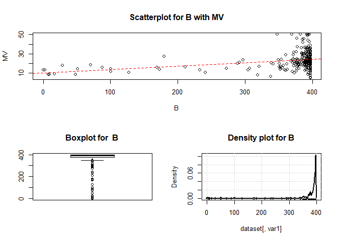

Linear Regression
================
Sumad Singh
9/22/2017

REGRESSION - PREDICTIVE TECHNIQUE FOR CONTINUOUS DEPENDENT VARIABLES, PARAMETRIC
================================================================================

CLASSIFICATION - FOR DISCRETE OUTCOME, PARAMETRIC AND NON PARAMETRIC
====================================================================

SECTION A
---------

1. LINEAR REGRESSION AS A TECHNIQUE - THE EQUATION AND USES
-----------------------------------------------------------

-   ESTABLISH A LINEAR RELATIONSHIP TO EXPLAIN VARIATION IN A RANDOM VARIABLE USING OTHER VARIABLES:
    Regression is a method to better explain the variation in a variable, using a set of variables called
    independent variables. With this relationship, we hope to predict the future values of the variable,
    better than a prediction of mean on an average. Better prediction means that the average error in prediction on an unseen data will be less than that produced by using preiction as a mean value of variable at hand.

FORMULATION : $Y = \_0 + \_1.X\_1 + \_2.X\_2 + $


We hypothesize a relationship as above we beleive applies to the population. Taking Expected value
operator on both sides, and with the below assumptions we get *E*(*Y*|*X*<sub>*i*</sub>)=*β*<sub>0</sub> + *β*<sub>1</sub>.*X*<sub>1</sub> + *β*<sub>2</sub>.*X*<sub>2</sub>


Basic Assumptions:
1. Expected value of error is 0.
2. Xi is fixed, i.e E(Xi) = Xi or Xi is not stochastic. This is a difficult assumption to hold, but as long as error is not correlated with Xi, this will hold.
3.ASSUMPTION OF ADDITIVE RELTIONSHIPS IN STATING LINEAR REGRESSION:
The coefficient of a predictor would give the effect of the predictor on response, with other
precictors remaining constant. This way, the net affect is additive.When we discover the effect is
multiplicative, we need to specify it

-   REGRESSION TO MEAN:
    The depenent variable is the mean predicted value, and not the actual value.

2. HYPOTHESIZED RELATIONSHIP, PRF AND SRF
-----------------------------------------

We work with a sample of data, so we hypothesize the relationship with variables in population
but estimate the parameters from a sample.

HOW EDA PLAYS A ROLE IN FORMULATING THE HYPOTHESIS:
- Data exploration from the sample is used to understand the following characteristics of the data
1. Continuous Variables:
a. Univariate Distributions - skewed, symmetrical and potential outliers
b. Bivariate Distributions - linear relationships between response and predictors that can be modeled or
non-linear relationships, which need to be approximated as linear or require a different modeling approach
2. Categorical Variables:
a. Distribution of response variable in each category of the categorical variable, does mean of response
increase linearly, or are too many categories that need consolidation

``` r
library(ggplot2)
library(car)
```

    ## Warning: package 'car' was built under R version 3.4.2

``` r
library(gridExtra)
library(dplyr)
```

    ## 
    ## Attaching package: 'dplyr'

    ## The following object is masked from 'package:gridExtra':
    ## 
    ##     combine

    ## The following object is masked from 'package:car':
    ## 
    ##     recode

    ## The following objects are masked from 'package:stats':
    ## 
    ##     filter, lag

    ## The following objects are masked from 'package:base':
    ## 
    ##     intersect, setdiff, setequal, union

``` r
#### Data Dictionary ####

# CRIM - per capita crime rate by town
# ZN - proportion of residential land zoned for lots over 25,000 sq.ft.
# INDUS - proportion of non-retail business acres per town.
# CHAS - Charles River dummy variable (1 if tract bounds river; 0 otherwise)
# NOX - nitric oxides concentration (parts per 10 million)
# RM - average number of rooms per dwelling
# AGE - proportion of owner-occupied units built prior to 1940
# DIS - weighted distances to five Boston employment centres
# RAD - index of accessibility to radial highways
# TAX - full-value property-tax rate per $10,000
# PTRATIO - pupil-teacher ratio by town
# B - 1000(Bk - 0.63)^2 where Bk is the proportion of blacks by town
# LSTAT - % lower status of the population
# MEDV - Median value of owner-occupied homes in $1000's

#### Analytics Problem is to predict House Prices ####
#### Data Quality Checks ####

# Read data,tag the appropriate class of each variables, specify what is missing value
# rm(list=ls())
dir <- "C:/Users/sumad.singh/Documents/DS/Supervised Learning/SL201/Linear Regression"
filename <- "boston_file.csv"
path <- file.path(dir,filename)
colclasses <- c(rep("numeric",3),"integer",rep("numeric",4),"integer", rep("numeric",5))
data <- read.csv(file = path, header = TRUE,
                 na.strings = c("", NA),colClasses = colclasses)

# Consolidate the following at variable level to answer the questions
#1. Does data have missing values
na_count <- function(x) {sum(is.na(x))}
na.count <- apply(X = data, MARGIN = 2,FUN = na_count)

#2. Are there too many categories in some variables
## Find the no. of unique values in each variable
unique_count <- function(x) {length(unique(x))}
unique.count <- apply(X = data, MARGIN = 2,FUN = unique_count)

df.quality <- data.frame(var = names(na.count), na.count = na.count, unique.count = unique.count)

#### Data Split to train (50%), test for tuning (30%) and val for final benchmarking (20%))

set.seed(101)
data$rand <- runif(n = nrow(data),min = 0,max = 1)
train <- data %>% filter(rand <= 0.5)
test <- data %>% filter(rand > 0.5 & rand <= 0.8)
val <-  data %>% filter(rand > 0.8) 


#### Exploratory Analysis ####
#1. Are the continuous variables skewed
#2. Do the continuous variables have outliers
#3. Do they exhibit a linear relationship with response variabes
#4. Are the predictor variables highly correlated with one another, in case of which their effect  
# will not be separated with the estimation technique
#5. Do the ordinal categorical variables exhibit a linear relationship with mean of response
#6. Are there too many thin categories that can be clubbed together

# These questions can be answered using visualization and determining some metrics
# VISUALIZATIONS
#1. plot() and scatterplotMatrix() give a good but constrained picture.Try picturing non-linear,
# relationships, splines, highly colinear relationships here.

#2.a.plot each variable with response, with a regression line
# b. Draw a density plot for each variable to gauge extreme skews
# c. Draw a boxplot to gauge extent of potential outliers, and direction

plot.scatter <- function(dataset, var1, response.var) {
plot(x = dataset[,var1], y = dataset[,response.var],type = "p",xlab = var1, ylab = response.var, 
       main = paste("Scatterplot for", var1, "with", response.var,sep = " " ))
abline(reg = lm(dataset[,response.var] ~ dataset[,var1]), lty = 2, lwd = 1.2, col = "red" )  
}

plot.box <- function(dataset, var1){
  # Boxplot plots, 1st and 3rd quantile, median to form hinges. Whiskers are formed 
  # 1.5IQR away from the quantiles,if the whiskers are away from the min or max, whisker/s is
  # dropped
  # The boxplot statistics can be seen using plot = FALSE argument, the function also gives
  # the list of outliers (outside of 1.5 IQR), in a vector accessible as $out
  boxplot(x = dataset[,var1],horizontal = FALSE,
          main = paste("Boxplot for ", var1))
}

plot.density <-  function(dataset, var1)  {
  # Need to understand how the density values are estimated for plotting
  densityPlot(x = dataset[,var1])
  title(main = paste("Density plot for", var1))
}

eda.continuous <- function(dataset, response.var, predictor.cont, dir){
  # function to draw the plots listed on points 1 and 2 above
#pdf(file.path(dir,"basic_eda.pdf"))
  scatterplotMatrix(dataset)
  for (var in predictor.cont){
    layout(mat = matrix(data = c(1,1,2,3),nrow = 2,byrow = TRUE))
  plot.scatter(dataset, var, response.var)
  plot.box(dataset, var)
  plot.density(dataset, var)   
  }
#  dev.off()
}

cont.vars <- colnames(train)[!colnames(train) %in% c("RAD","CHAS")]

eda.continuous(dataset = train,response.var = "MV", 
               predictor.cont = cont.vars,
               dir = dir)
```

    ## Warning in smoother(x, y, col = col[2], log.x = FALSE, log.y = FALSE,
    ## spread = spread, : could not fit smooth

    ## Warning in smoother(x, y, col = col[2], log.x = FALSE, log.y = FALSE,
    ## spread = spread, : could not fit smooth

    ## Warning in smoother(x, y, col = col[2], log.x = FALSE, log.y = FALSE,
    ## spread = spread, : could not fit smooth

    ## Warning in smoother(x, y, col = col[2], log.x = FALSE, log.y = FALSE,
    ## spread = spread, : could not fit smooth

    ## Warning in smoother(x, y, col = col[2], log.x = FALSE, log.y = FALSE,
    ## spread = spread, : could not fit smooth

    ## Warning in smoother(x, y, col = col[2], log.x = FALSE, log.y = FALSE,
    ## spread = spread, : could not fit smooth

    ## Warning in smoother(x, y, col = col[2], log.x = FALSE, log.y = FALSE,
    ## spread = spread, : could not fit smooth

    ## Warning in smoother(x, y, col = col[2], log.x = FALSE, log.y = FALSE,
    ## spread = spread, : could not fit smooth

    ## Warning in smoother(x, y, col = col[2], log.x = FALSE, log.y = FALSE,
    ## spread = spread, : could not fit smooth

    ## Warning in smoother(x, y, col = col[2], log.x = FALSE, log.y = FALSE,
    ## spread = spread, : could not fit smooth

    ## Warning in smoother(x, y, col = col[2], log.x = FALSE, log.y = FALSE,
    ## spread = spread, : could not fit smooth

    ## Warning in smoother(x, y, col = col[2], log.x = FALSE, log.y = FALSE,
    ## spread = spread, : could not fit smooth

    ## Warning in smoother(x, y, col = col[2], log.x = FALSE, log.y = FALSE,
    ## spread = spread, : could not fit smooth

    ## Warning in smoother(x, y, col = col[2], log.x = FALSE, log.y = FALSE,
    ## spread = spread, : could not fit smooth

    ## Warning in smoother(x, y, col = col[2], log.x = FALSE, log.y = FALSE,
    ## spread = spread, : could not fit smooth

    ## Warning in smoother(x, y, col = col[2], log.x = FALSE, log.y = FALSE,
    ## spread = spread, : could not fit smooth

    ## Warning in smoother(x, y, col = col[2], log.x = FALSE, log.y = FALSE,
    ## spread = spread, : could not fit smooth

    ## Warning in smoother(x, y, col = col[2], log.x = FALSE, log.y = FALSE,
    ## spread = spread, : could not fit smooth

    ## Warning in smoother(x, y, col = col[2], log.x = FALSE, log.y = FALSE,
    ## spread = spread, : could not fit smooth



``` r
#3.  Metrics
# Summary with measures of central tendency and variation:
df.summary <- apply(X = data, MARGIN = 2, FUN = summary)
# quantiles and number of potential outliers
# Correlation matrix
# VIF
# Influential Observations
```

### OBSERVATIONS

#### LINEARITY

-   CRIM can be seen to have potential outliers (from boxplot, point more than 3IQR will be &gt;20), which are likley decreasing the slope of the line, it also has a very left skewed distribution, so linear relationship is difficult to hypothesize, unless with a transformation

-   Strong linear relationships are evident with RM, LSTAT based on the slope of the regression line, and how close the points are positioned around it
-   Medium linear relationships : CRIM, INDUS,NOX, TAX, PT.

-   Weak linear relationships :

#### SKEW

#### OUTLIERS

WHY USE AN INTERCEPT IN THE MODEL

3. ASSUMPTIONS OF LINEAR MODEL
------------------------------

-   VALIDATE HYPOTHESES ABOUT RELATIONSHIPS

4. ESTIMATION TECHNIQUES USING DATA- PROPERTIES OF GOOD ESTIMATION TECHNIQUES, WHY OLS IS GOOD
----------------------------------------------------------------------------------------------

BLUE IF NO HETEROSCEDASTICITY AND AUTOCORRELATION \#\#\#4.1 DATA SELECTION, SAMPLING, OUTLIERS,INFLUENTIAL OBSERVATION CONSIDERATIONS \#\#\#4.2 TRANSFORMATION OF CATEGORICAL VARIABLES \#\#\#\#4.2.1 DUMMY VARIABLES AND DUMMY VARIABLE TRAP \#\#\#\#4.2.2 BASE LEVEL SELECTION \#\#\#\#4.2.3 IDENTIFICATION OF INTERACTIONS This helps hypothesize, but whether it increase variance is tested by independent test set \#\#\#\#\#4.2.3.1 GRAPHICAL METHOD
\#\#\#\#\#4.2.3.2 USE OF DECISION TREES OR CHAID \#\#\#\# 4.2.4 HOW OUTLIERS AND INFLUENTIAL OBSERVATIONS AFFECT ESTIMATION

5. PARAMETER ESTIMATES, THEIR STD. ERROR, P VALUE - INTERPRETATION
------------------------------------------------------------------

### 5.1 HOW CAN WE COMPARE PARTIAL REGRESSION COEFFICIENTS

### 5.2 HOW SHOULD DIFFERENCE IN SCALE OF VARIABLES BE MANAGED?

RUN REGRESSION ON STANDARDIZED AND CONVERT TO ACTUAL SCALES?

6. VALIDATION OF ASSUMPTIONS - HOW TO,CONSEQUENCES OF FAILURE, TREATMENT
------------------------------------------------------------------------

### 6.1CRUCIAL ASSUMPTIONS

6.1.1 NORMALITY OF ERRORS: CHISQUARE GOODNESS OF FIT (LARGE SAMPLE TEST), ANDERSON DARLING, QQ PLOT; ESSENTIAL FOR RELIABILITYF AND T TESTS; TRANSFORM SKEWED VARIABLES, SPECIFY MODEL BETTER, INCREASE SAMPLE SIZE 6.1.2 HOMOSCEDASTICITY : BREUSCH PAGAN TEST, WHITE TEST,GOLDFIELD QUANDT TEST, GRAPHICAL METHOFS OF PLOTTING STDIZED ERRORS WITH VARIABLES (SCATTER PLOT OF STANDARDIZED RESIDUALS WITH INDEPENDENT VARIABLES TO CHECK FUNNEL IN/OUT SHAPE,
SAME WITH STANDARDIZDED PREDICTED VALUES
OFTEN LEADS TO TRANSFORMATION OF DEPENDENT VARIABLE, CAN TIE IT BACK TO SKEWED DISTRIBUTION
OF DEPENDENT);
OLS DOES NOT GIVE BEST ESTIMATES,STD.ERROR WOULD BE HIGH, TREATMENT IS WEIGHTED OLS (USED IN GLMS) AS OLS GIVES
EQUAL WEIGHT TO ALL OBSERVATIONS, ALSO GIVES BIASED STD. ERRORS OF B'S (DEFLATES) SO RELIABILITY OF T TESTS IS IN QUESTION 6.1.3 MULTICOLINEARITY: PERFECT MC : NOT POSSIBLE TO ESTIMATE COEFFICIENTS HIGH BUT NOT PERFECT : VIF &gt;1, CONFLICT IN F TEST AND T TEST; INFLATED STD. ERRORS, CAN REJECT SIGNIFICANT VARS.; DROP VARIABLES, CONSOLIDATE, INCREASE SAMPLE SIZE 6.1.4 AUTOCORELATION: DURBIN WATSOM TEST, D = 2 THEN NO AC; ADD VARIABLES TO REMOVE AC, USE DUMMY VARS

### 6.2 VALIDATE HYPOTHESIS

6.2.1WHY DO F TEST 6.2.2 T TEST - INDIVIDUAL B IS O WHILE OTHERS ARE NON ZERO OR ZERO, THAT IS WHY
Under Null Hyp. B = 0 , i.e population parameter is o, so from multiple SRFs, the mean of Bs will
be equal to population mean i.e 0. Std. error of this distribution of B, needs using standard deviation
of B from the same, hence use t statistic.
6.2.3 RESIDUAL TESTS SPECIFICATION BIAS CAN BE PICKED UP, LIKE NON LINEAR RELATIONSHIPS TEST FOR NORMALITY AND HOMSCEDASTICITY ALREADY DISCUSSED

### 6.3 TRANSFORMATIONS

NECESSARY FOR HETEROSCEDASTICITY, NORMLITY, NON LINEAR RELATIONSHIP \#\#\#\#6.3.1 GUIDELINES FOR TRANSFORMATION TO APPLY
FOR HETEROSCEDASTICITY FOR LINEARITY

7. VARIABLE SELECTION
---------------------

### 7.1 HOW TO SEE EFFECT OF ADDING/ REMOVING A VARIABLE

#### 7.1.1 USING CONCEPT OF PART AND PARTIAL CORRELATIONS

ADDING A VARIABLE IMPROVES R2 EQUAL TO SQ. OF SEMI-PARTIAL CORRELATION \#\#\#\#7.2 HOW TO TEST OF VARIABLE SHOULD BE ADDED USE ADJUSTED R SQUARE ESS/ TSS -&gt; USE OF DF -&gt; ADJ RSQ = 1- (RSS/N-K-1)/(TSS/N-1) %AGE DECRREASE IN RSS SHOULD BE MORE THAN % DECREASE IN DF BY ADDING VARIABLE TO DECREASE ADJ. R2 \#\#\#\#7.3 PARTIAL F TEST FOR A BUNCH OF VARIABLES WHAT IS THE Hypothesis \#\#\# NOTE : F TEST FOR VARIABLE SELECTION RELIES ON TESTING THE HYPOTHESIS THAT A DECREASE IN RSS IS ACCOMPISHED THAT IS NOT A MATTER OF CHANCE. BUT, IT DOES NOT ACCOUNT FOR AN INCREASE IN VARIANCE BY ADDING OF THE VARIABLE IF F TEST SUGGESTS SO,
TEST FOR BIAS/VARIANCE IS ENTIRELY DIFFERENT DONE

8. ESTIMATE STANDARD ERROR OF REGRESSION I.E SD OF REGRESSION
-------------------------------------------------------------

MSE I.E RSS/N-K-1 IS AN UNBIASED ESTIMATOR OF VARIANCE OF THE REGRESSION \#\#9. GOODNESS OF FIT MEASURES - LIMITATIONS OF RSQ FOR SELECTION \#\#10. HOW EQUATION IS USED FOR PREDICTION \#\#\# variance of yhat vs variance of E(Y|Xi)

SECTION B

MODELING STRATEGY WITH REGRESSION
=================================

DATA SELECTION
--------------

DATA QUALITY
------------

DATA SAMPLING INTO TRAIN, TEST AND VAL or WHEN CAN WE USE CROSS VALIDATION - WHY?
---------------------------------------------------------------------------------

EDA - UNIVARIATE, BIVARIATE, CORRELATIONS, EXTREME VALUES CAPPING
-----------------------------------------------------------------

AGAIN THIS PART IS MEANT TO ASSIST IN FORMULATING THE RELATIONSHIP \#\# FEATURE ENGINEERING BASED ON EDA, BUSINESS KNOWLEDGE, ITERATIONS \#\# VARIABLE SELECTION STRATEGY \#\#\# TRADITIONAL - FORWARD, BACKWARD AND MIXED SELECTION, SHORTCOMINGS \#\#\#\# Uses Partial F test \#\#\# NEW - LASSO \#\# MODEL FITTING - UNDERSTANDING LOSS FUNCTIONS \#\# BIAS VS VARIANCE TRADE OFF - MODELS PERFORMANCE ON A TEST SET USING AN ASSESSMENT CRITERIA \#\#\# MAKE MULTIPLE MODELS TO REDUCE SPEC. BIAS AS YOU LEARN AND BETTER HYPOTHESIS
USE CV AND AN ASSESSMENT MEASURE LIKE MSE, AND DERIVE THE MEAN AND SD. OF THE MSE
THEN CHOOSE THE SIMPLEST MODEL WITHIN 1 SD. OF THE MSE OF MODEL WITH LOWEST MSE

### ASSESSMENT METRIC TO EVALUATE BEST MODEL

AIC, BIC, MSE, DEVIANCE

OTHER STRATEGIES WITH REGRESSION FOR PRICING
============================================

ADDING CONSTRAINTS OF MONOTONICITY OF COEFFICIENT FOR A FACTOR VARIABLES
------------------------------------------------------------------------

As no. of faults increase, the coefficient should increase \#\# ADDING INTERACTIONS TO PROVIDE BENEFITS AS NO. OF FAULTS INCREASE, BUT SO DO NUMBER OF CARS ON POLICY, SHOULD PROVIDE BENEFIT So, add an interaction variable \#\# DELIBERATELY KEEPING SOME CATEGORICAL VARIABLES INSTEAD OF CONTINUOUS TO AVOID TOO THIN SEGMENTATION
\#\# FOR COMPETITIVE ADVANTAGE Age of drivers could be continuous,and the premium on policy will change at end of policy period due
to increase in age if it were continuous, may not if it were categorical, and birthday lies in the
current policy period.
You may want to do thin segmentatin on variables that have very high propensity for predicting risk \#\# TESTING FOR DISCRIMINATION USING INTERACTION Can no. of females on policy be used for pricing, may be only along with no, of males? \#\# USING AN OFFSET TO FIX THE BASE PRICE USING A SEPARATE MODEL
